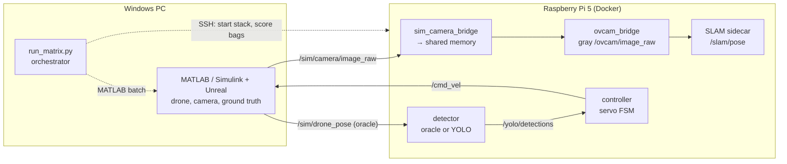

# ROS2 SLAM and Controller Experiment

Branch: `benchmarks/slam-hil`

**Maintainer:** Amar Aly

> **Hardcoded addresses.** Several configs and scripts contain the maintainer's IP
> addresses, SSH login and Windows paths (for example `amaraly@192.168.1.60`,
> `192.168.1.201`, `192.168.137.1`, `C:\Users\homie\...`). Nothing works on another
> setup until these values change. The list is in
> [Set the machine-specific values](#4-set-the-machine-specific-values).

---

## What this branch is

This branch is a hardware-in-the-loop (HIL) test bench. It evaluates visual SLAM
backends and visual-servoing controllers on a Raspberry Pi 5, while a simulator
provides the drone, the camera and the ground truth.

The question behind it is simple. How do these algorithms behave on the real compute
target, with real middleware and a real network in the loop? Offline datasets do not
answer that. They remove the CPU budget, the DDS transport and the frame delivery
jitter, and those are exactly the things that break an embedded pipeline.

The main idea is to keep the simulator and the onboard stack on separate machines.
The simulator runs on a Windows PC. The Pi runs the perception, SLAM and control
stack. On the camera path, the simulator replaces only the camera driver, so the
image bridge and the detector run the same code they would run onboard.

The current implementation is a research prototype. It produces repeatable runs and
scores them, but several parts still depend on the maintainer's machines (see
[Known issues](#known-issues-and-what-does-not-work-yet)).

### Architecture



The pieces have clear responsibilities:

- **Simulator (PC).** MATLAB/Simulink with Unreal renders the scene. It publishes the
  camera images, the drone pose, the target pose and a heartbeat over ROS 2, and it
  subscribes to `/cmd_vel`.
- **Camera bridge (Pi).** `sim_camera_bridge` takes the place of the real camera driver.
  It writes the simulated frames into the same shared memory the real driver uses, so
  `ovcam_bridge` and the detector run unchanged.
- **SLAM sidecar (Pi).** Each SLAM backend runs in its own Docker container, started by
  `run_stack_hil.sh`. It reads `/ovcam/image_raw` and publishes `/slam/pose` and
  `/slam/tracking_state`.
- **Controller (Pi).** All controllers share one finite-state machine
  (`servo_core::ServoFsmNode`: SEARCHING, APPROACHING, REACQUIRE, REACHED) and swap
  only the control law. Any difference between controllers is therefore the law
  itself, not the state machine or the safety filters.
- **Orchestrator (PC).** `scripts/hil_matrix/run_matrix.py` restarts MATLAB, starts the
  Pi stack over SSH, flies N trials and asks the Pi to score them from the bags.

Why separate the SLAM backend from the main stack?
Each backend has its own build, its own dependencies and its own failure mode. A
separate container per backend means a backend can crash, restart or be swapped
without touching the camera, detector or controller path.

### Two kinds of experiment

The bench runs two experiments. The important distinction is who flies the drone.

1. **SLAM benchmark.** A scripted probe in MATLAB flies a fixed path. The controller
   does not fly. The SLAM pose is scored against ground truth (APE with Sim(3)
   alignment). This isolates SLAM accuracy from control behavior.
2. **Controller experiment.** The controller flies the drone closed-loop to a target.
   The detector is the oracle (a perfect, deterministic box) or YOLO. SLAM is optional.

---

## Installation guide

You need two machines on the same network:

- a **Windows PC** with MATLAB/Simulink,
- a **Raspberry Pi 5** (64-bit OS, Docker installed).

A Hailo HAT is only necessary for the YOLO detector. The oracle detector needs no
extra hardware, and every SLAM benchmark config in this branch uses it.

### 1. Clone the repository on both machines

```bash
git clone -b benchmarks/slam-hil <repo-url> ~/ROS2-slam-hil
```

On Windows, clone anywhere and note the path of the `matlab/` folder.

### 2. Build the Docker images on the Pi

The images are not in git. Each stack config names the image it needs.

```bash
cd ~/ROS2-slam-hil

# Main stack, OV2SLAM and all controllers (ROS 2 Jazzy, ViSP 3.6.0)
sudo docker build -t ros2_perception_stack:latest .

# ORB-SLAM2
bash src/orbslam2/docker/build.sh            # tags orbslam2_fixed:latest

# ORB-SLAM3 (main image recipe plus the Pangolin build dependencies)
sudo docker build -f src/orbslam3/Dockerfile.upstream -t orbslam3_container:latest .

# RTAB-Map (no Dockerfile in the repo; this recipe comes from the image's layer history)
printf 'FROM ros:jazzy-ros-base\nRUN apt-get update && apt-get install -y ros-jazzy-rtabmap ros-jazzy-rtabmap-ros && rm -rf /var/lib/apt/lists/*\n' \
  | sudo docker build -t rtabmap-jazzy-arm64:latest -
```

### 3. Build the workspace and the SLAM backends

These build outputs are in `.gitignore`, so each new Pi builds them once.

- **Main colcon workspace** (`install/`, `build/`):

  ```bash
  ./run_stack_hil.sh build
  ```

  This runs colcon inside a throwaway container. Do not run a bare `colcon build` at
  the repo root. The workspace also contains the vendored SLAM sources.

- **ORB-SLAM2** (`src/orbslam2/lib`, `src/orbslam2/Thirdparty/g2o/lib`,
  `src/orbslam2/install_stereo/`): follow `src/orbslam2/README_HIL.md` and
  `src/orbslam2/build_stereo_2026-09-08.sh`.
- **ORB-SLAM3** (`src/orbslam3/install/`, `src/orbslam3/Pangolin/build/`): follow
  `src/orbslam3/README.md`. Pangolin builds in-tree. The stack configs load it from
  `src/orbslam3/Pangolin/build`.
- **Vocabulary files** (large, not in git): `src/orbslam2/Vocabulary/ORBvoc.txt` and
  `src/orbslam3/orb_slam3/Vocabulary/ORBvoc.txt.bin`.

### 4. Set the machine-specific values

These values point at the maintainer's machines. Change them before the first run.

| Value | Where it lives |
|---|---|
| Pi SSH login and IP (`amaraly@192.168.1.60`) | `pi:` in `config/hil/matrix/*.yaml`; `scripts/hil_matrix/run_matrix.py`; `scripts/hil_matrix/run_baseline_matrix.py`; `PI=` in `scripts/hil_matrix/run_baseline_sweep.sh` and `run_rtab_repeat.sh` |
| Repo path on the Pi | `pi_repo:` in `config/hil/matrix/*.yaml`; `PI_REPO=` in `run_baseline_sweep.sh` and `run_rtab_repeat.sh` |
| Windows `matlab/` path | `matlab_dir:` in `config/hil/matrix/*.yaml`; `REPO=` in `run_baseline_sweep.sh` and `run_rtab_repeat.sh` |
| MATLAB PC address, as the Pi sees it | `network.matlab_host_ip` in each `config/hil/stack/*.yaml` |

The orchestrator also needs passwordless SSH from Windows to the Pi. `ssh <pi> true`
must succeed without a prompt.

### 5. Prepare MATLAB

Follow `SIM_HIL.md` for the MATLAB startup sequence and the Windows firewall rule.
Before `hil_ros_init_LT`, set the DDS implementation to match the Pi config you plan
to run (see [Setup](#setup-ros-2-dds-domain-id-transport-and-library-versions)):

```matlab
clear all
setenv('RMW_IMPLEMENTATION','rmw_fastrtps_cpp')   % or rmw_cyclonedds_cpp
setenv('ROS_DOMAIN_ID','0')
run hil_ros_init_LT
```

---

## What is in this branch and what is out?

**In:**

- **Mono SLAM:** OV2SLAM (accurate, fast, fast with CLAHE), ORB-SLAM2, ORB-SLAM3.
- **Stereo SLAM:** OV2SLAM (accurate, fast), ORB-SLAM2, ORB-SLAM3, RTAB-Map.
- **Controllers:** proportional (`hil_servo`), IBVS (`visp_servo`, ViSP), and
  homography-based 2D visual servoing (`h_vs_servo`).
- **Stereo baseline models:** `matlab/hil_closed_loop_baseline_{011,036,042,054,061}.slx`.
- **Orchestration and scoring:** `scripts/hil_matrix/` (`run_matrix.py`,
  `run_baseline_matrix.py`, `fly_baseline.py`, `aggregate_matrix.py`, `sync_baseline.py`).

**Out:**

- **RGB-D**, for every backend. It exists locally and stays out of this branch until
  it is reviewed (see [RGB-D to-do list](#rgb-d-to-do-list)).
- **PBVS** (`visp_pbvs_servo`). The code is present, but PBVS is not supported yet.

---

## Setup: ROS 2, DDS, domain ID, transport and library versions

| Item | Value |
|---|---|
| ROS 2 | **Jazzy**, in every Docker image |
| Domain ID | `0` (`network.ros_domain_id` in every stack config) |
| DDS | Per stack config, in `network.dds`. 23 configs use `fastrtps` and 24 use `cyclonedds`. The SLAM benchmark configs (`*_stereo_oracle_nopin`, `*_nopin_wifi`) use **fastrtps**. `benchmarks/controller_hil_bench.sh` forces **CycloneDDS**. |
| Transport | `network.matlab_host_ip` in the stack config. The Pi routes to that address (`ip route get` in `run_stack_hil.sh`), so the address picks Wi-Fi or Ethernet. |
| ViSP | 3.6.0 (`libvisp-*-dev 3.6.0-2.1build3` in `ros2_perception_stack`) |
| ORB-SLAM3 | core **V1.0**, ROS 2 wrapper `Mechazo11/ros2_orb_slam3` **v2.0.0** (Jazzy), vendored in `src/orbslam3/` |
| ORB-SLAM2 | vendored in `src/orbslam2/`, from `alsora/ORB_SLAM2` and `alsora/ros2-ORB_SLAM2`. The upstream commit is not recorded. |
| OV2SLAM | vendored in `src/ov2slam_ros/`, from `ov2slam/ov2slam`. The upstream commit is not recorded. |
| RTAB-Map | `ros-jazzy-rtabmap 0.22.1` (in `rtabmap-jazzy-arm64`) |

The stereo `*_nopin.yaml` stack configs point at the Ethernet host (`192.168.137.1`).
Their `*.yaml.wifibak` twins point at the Wi-Fi host (`192.168.1.201`). The two files
differ only in that address.

Why does the DDS matter this much?
MATLAB and the Pi only discover each other when both use the same DDS implementation.
A mismatch produces no error. The drone simply never moves.

---

## How do I launch each controller and SLAM combination, and which flag selects them?

Everything starts from a **stack config** in `config/hil/stack/`. Its
`controller.type` field selects the controller. Its `slam:` block selects the SLAM
backend, or disables SLAM entirely. A **matrix config** in `config/hil/matrix/` sits one
level above: it names the stack config, the number of trials and the run rules for the
orchestrator.

### A. SLAM benchmark (Windows, Git Bash)

```bash
py scripts/hil_matrix/run_matrix.py --config only_ov2_stereo_oracle_nopin --dry-run   # print every step, fly nothing
py scripts/hil_matrix/run_matrix.py --config only_ov2_stereo_oracle_nopin --trials 10
```

| SLAM | Mono matrix config | Stereo matrix config |
|---|---|---|
| OV2SLAM accurate | `only_ov2_accurate_mono_nopin` | `only_ov2_stereo_oracle_nopin` |
| OV2SLAM fast | `only_ov2_fast_mono_nopin` | `only_ov2_stereo_oracle_fast_nopin` |
| ORB-SLAM2 | `only_orbslam2_mono_nopin` | `only_orbslam2_stereo_oracle_nopin` |
| ORB-SLAM3 | `only_orbslam3_mono_nopin` | `only_orbslam3_stereo_oracle_nopin` |
| RTAB-Map | no mono path | `only_rtabmap_stereo_oracle_nopin` |

To fly stereo at a specific baseline, use the baseline runner. It swaps the Simulink
model and syncs the Pi calibration before the first trial:

```bash
py scripts/hil_matrix/run_baseline_matrix.py --config only_ov2_stereo_oracle_nopin --baseline 0.36 --run-tag BASELINE036
py scripts/hil_matrix/fly_baseline.py --baseline 0.36      # all five stereo arms in order
```

### B. Controller experiment: standalone bench (Pi, inside the container)

```bash
./enter_container.sh
MATLAB_HOST_IP=<windows-ip> ./benchmarks/controller_hil_bench.sh <proportional|ibvs|h_vs> [run_num] [duration_sec] [benchmark_mode]
python3 benchmarks/plot_controller_hil.py bags/ctrl_<controller>_N<run>_<stamp>
```

This path uses the oracle detector, starts no SLAM and forces CycloneDDS. The
full runbook is `benchmarks/CONTROLLER_BENCH_PLAN.md`. `benchmarks/compare_controllers.py`
compares runs across controllers.

### C. Controller experiment: full stack (Pi)

```bash
./run_stack_hil.sh --config <stack-config>
CONTROLLER=ibvs ./run_stack_hil.sh --config <stack-config>   # override the controller
```

| Stack config | Detector | Controller | SLAM |
|---|---|---|---|
| `default` | YOLO | IBVS | off |
| `ibvs` | YOLO | IBVS | off |
| `h_vs` | YOLO | h_vs | off |
| `oracle` | oracle | IBVS | off |
| `full_ov2slam` | YOLO | proportional | OV2SLAM |
| `ov2slam_ibvs` | YOLO | IBVS | OV2SLAM, depth from the bounding box |
| `ov2slam_ibvs_slamdepth` | YOLO | IBVS | OV2SLAM, depth from SLAM |
| `ov2slam_oracle` | oracle | proportional | OV2SLAM, benchmark mode |

Without `--config`, `run_stack_hil.sh` falls back to `CONTROLLER=proportional`. That is
not the same as `--config default`.

---

## Which stereo baseline, and what rule picks it?

The stereo baseline lives in two places, and the two must agree:

1. **Physical, in Simulink.** The right camera's mount offset in
   `matlab/hil_closed_loop.slx`. The baseline runner copies
   `matlab/hil_closed_loop_baseline_<XXX>.slx` over it.
2. **Calibrated, on the Pi.** Five files, one per backend, each in its own format:

| Backend | File | Field |
|---|---|---|
| OV2SLAM accurate | `camera_calib/hil_sim_ov2slam_stereo.yaml` | `body_T_cam1` translation |
| OV2SLAM fast | `camera_calib/hil_sim_ov2slam_stereo_fast.yaml` | `body_T_cam1` translation |
| ORB-SLAM2 | `src/orbslam2/ros2-ORB_SLAM2/src/stereo/hil_sim.yaml` | `Camera.bf` (= 554 × baseline) |
| ORB-SLAM3 | `src/orbslam3/orb_slam3/config/Stereo/HIL_SIM.yaml` | `Stereo.b` |
| RTAB-Map | `src/rtabmap_docker/hil_stereo_bridge.py` | `BASELINE_M` |

This matters because a mismatch is silent. SLAM computes depth from the calibrated
baseline, so a wrong value scales every depth estimate and raises no error.

`scripts/hil_matrix/sync_baseline.py` writes all five files and reads each one back.
`run_baseline_matrix.py --baseline` and `run_baseline_sweep.sh` run both steps for you.
To sync by hand, from the repo root on the Pi:

```bash
python3 scripts/hil_matrix/sync_baseline.py 0.36
```

The repository sits at **0.11 m**. Runs exist at 0.11, 0.36, 0.42, 0.54 and 0.61 m.

### Why these baselines?

The selection follows from stereo disparity (pixel shift). A stereo pair measures depth
through how far a point shifts, in pixels, between the left and right images:

```
disparity (pixel shift)  d = B · f / Z
```

with baseline `B`, focal length `f` and depth `Z`. Depth precision depends on that
shift. When the disparity is only a pixel or two, a sub-pixel matching error becomes a
large depth error, and the two camera rays are close to parallel.

The 0.11 m starting value comes from the EuRoC stereo template that the HIL settings
use (`src/orbslam3/orb_slam3/config/Stereo/HIL_SIM.yaml`). It is a dataset default,
not a value sized for this scene. The scored flight here covers about 34 m. With the simulator's
focal length of 554 px and an assumed depth of 34 m, each baseline gives:

| Baseline | Disparity (pixel shift) at 34 m | Role in the sweep |
|---|---:|---|
| 0.11 m | 1.8 px | dataset default; the narrow-baseline reference |
| 0.36 m | 5.9 px | midpoint estimate (see below) |
| 0.42 m | 6.8 px | wider baseline |
| 0.54 m | 8.8 px | wider baseline |
| 0.61 m | 9.9 px | widest baseline flown |

At 0.11 m the shift is under 2 pixels. That is why the narrow baseline is a weak
choice at this range. The wider baselines raise the disparity to roughly 6 to
10 pixels.

The 0.36 m value is the mean of 0.11, 0.42 and 0.54 m (0.357 m). It is not a rigorous
optimum. It is a first estimate of a midpoint between the narrow reference and the
wider baselines, and the sweep tests it alongside them.

The 34 m depth is the start of the approach. The distance to the target only shrinks
during the flight, so the target's disparity (pixel shift) only grows from these values.
The table is the worst case for the target. Far background points stay at small
disparities with any of these baselines.

---

## How do I know whether the controller uses SLAM, and how do I run with SLAM off?

Only **IBVS** can use SLAM. In the stack config, `controller.use_slam_depth: true` makes
IBVS take its depth from the SLAM map points instead of the bounding box. The code
also has a `use_slam_pose` option. No config in this branch turns it on.

The IBVS node prints one line at startup that answers the question:

```
IBVSController (TS1): lambda=0.30 k_fwd=3.00 depth='bbox' slam_pose=OFF standoff=3.0m
```

- `depth='bbox'`: the controller does **not** use SLAM.
- `depth='slam(fallback=bbox)'`: the controller **does** use SLAM depth. A second line
  follows: `SlamDepthSource active — pose='...' cloud='...' scale=...`.
- `slam_pose=ON`: the SLAM pose gate is active.

`ov2slam_ibvs` and `ov2slam_ibvs_slamdepth` form an A/B pair. They are identical except
for `use_slam_depth`.

**To run with SLAM off,** pick a stack config without SLAM (`default`, `ibvs`, `h_vs`,
`oracle`) or set `slam.enabled: false` in your own config. The standalone controller
bench never starts SLAM.

---

## Topics and rates

The rates below come from recorded bags, except where marked as configured.

| Topic | Producer | Rate |
|---|---|---|
| `/sim/camera/image_raw` (plus the right eye for stereo) | MATLAB | follows camera delivery: about 16 Hz mono, about 11 Hz stereo |
| `/ovcam/image_raw`, `/ovcam/right/image_raw` | `ovcam_bridge` (gray) | same as camera delivery |
| `/sim/drone_pose`, `/sim/heartbeat` | MATLAB | 16.2 Hz in a mono run, 11.0 Hz in a stereo run |
| `/sim/target_pose` | MATLAB | 0.6 to 0.8 Hz |
| `/slam/pose` | SLAM sidecar | one pose per tracked frame: 16.0 Hz mono, 10.9 Hz stereo |
| `/slam/tracking_state` | SLAM sidecar | `2` means tracking |
| `/yolo/detections` | oracle detector | 20 Hz, configured (`config/hil/bench_oracle.yaml`) |
| `/cmd_vel` | controller | one command per `/yolo/detections` message, plus a no-detection path; no fixed rate |
| `/bench/state` | controller FSM | FSM state for scoring |

In these bags, the simulator state topics arrive at the camera delivery rate. The
orchestrator also checks "pacing": the slope of simulation time against wall time on
the Pi. A trial outside `pacing_lo` to `pacing_hi` (0.85 to 1.15 in the matrix configs)
fails.

---

## Known issues and what does not work yet

- **Hardcoded addresses and paths.** See the warning at the top and
  [step 4](#4-set-the-machine-specific-values).
- **The DDS must match.** MATLAB reads `RMW_IMPLEMENTATION` once, at init
  (`matlab/hil_ros_init_LT.m`). Switching between the CycloneDDS controller bench and a
  fastrtps stack config requires `clear all`, a new `setenv` and a fresh
  `hil_ros_init_LT`. A mismatch gives no error. Nothing moves.
- **Camera focal length.** `config/hil/bench_fsm.yaml` sets `cam_fx = cam_fy = 554`, the
  focal length of the Simulink camera. The controller's camera model has to match the
  simulator, so change both together if the camera block changes.
- **PBVS is not supported yet.**
- **`--transport` does not switch the network.** In `run_baseline_matrix.py` it changes
  only the SSH host. `matlab_host_ip` in the Pi stack config decides the camera link.
- **RTAB-Map stereo runs 3 trials by default.** `only_rtabmap_stereo_oracle_nopin.yaml`
  sets `trials: 3`. Pass `--trials 10`.
- **The RTAB-Map image has no Dockerfile in the repo.** The recipe in step 2 comes from
  the image's layer history.
- **The ORB-SLAM2 and OV2SLAM upstream commits are not recorded.** The vendored copies
  in `src/` are the reference.

---

## What does a healthy run look like?

**Orchestrator (Windows), one SLAM trial:**

```
STEP  ov2_accurate_t1 / verify pacing
      pacing 1.001
STEP  ov2_accurate_t1 / wait for SLAM to consume frames
      SLAM consuming frames (14 -> 69 events)
STEP  ov2_accurate_t1 / verify SLAM initialised
      SLAM initialised during init cycle: YES (tracking_state=2)
      probe returned after 29.5s
      non-zero SLAM poses: 626
OK    ov2_accurate_t1 / validate trial  (6.1s)
...
== DONE: 10/10 trials valid -> results/matrix_<stamp>
```

- Pacing stays close to 1.0.
- ORB-SLAM3 prints `SLAM ready (handshake ACKed)` instead of `SLAM consuming frames`.
  It writes its timing file only at shutdown, so the orchestrator waits for its
  handshake instead.
- A summary table follows (APE RMSE, input Hz, pose Hz, track ms, CPU). The Pi
  computes it with `aggregate_matrix.py` from the bags.

**Controller (Pi), state transitions:**

```
State: SEARCHING -> APPROACHING  (consec=... ratio=... ex=... ey=...)
```

The FSM moves from SEARCHING to APPROACHING and ends in REACHED.
`APPROACHING -> REACQUIRE` or `REACQUIRE -> SEARCHING (timed out ...)` means the target
leaves the view.

---

## RGB-D to-do list

RGB-D works locally for RTAB-Map and ORB-SLAM2 but is not part of this branch yet.

- [ ] Review the RGB-D files and decide what enters the branch.
- [ ] Build the ORB-SLAM3 RGB-D HIL harness: one stack config, one matrix config and
      a one-trial test runner.
- [ ] Decide how to score ORB-SLAM3 when a tracking loss creates a new map. The live
      pose jumps between map frames, which inflates APE.
- [ ] Measure why RTAB-Map processes only part of the available RGB-D frames.
- [ ] Add an "available-frame coverage" column for every RGB-D run.
- [ ] Test true color input. It needs a gigabit (Cat6) link for 20 Hz color plus depth.
- [ ] Make the 10 s shared-memory wait in the RGB-D stack script robust to a slow first start.
- [ ] Re-run stereo under the same transport as RGB-D, so mono, stereo and RGB-D compare
      on equal terms.
