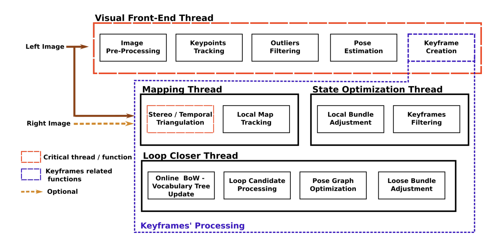

# OV2SLAM Research Study 
*by Amar Aly* 

----
In this research document, the following topics will be explains
- SLAM in general
- Research Directions
- OV2SLAM Core Algorithm
- Other SLAM Algorithms (TBD)

## Introduction
SLAM (Simultanous Localization And Mapping) is an algorithm that runs online on a device in order to help the device *locate* where it is and map the *environment* around it. However there is one important note to understand before ever proceeding, is the modularity of SLAM algorithms.
SLAM algorithms are modular in principle, but that does not imply that they are input type agonstic. In other words, you cannot simply convert from a LiDAR-SLAM made to Visual SLAM, and since my project is about Visual SLAM, then I will limit my research and discussion to VSLAM algorithms only.

## SLAM in general
A SLAM Algorithm typically consists of these 4 things:
- Frontend
- Backend
- Mapping
- Loop Closure

### Frontend
this is the first point of contact with the input of the world (either camera frames, LiDAR, IMU data, etc..), this module processes the input given to the SLAM algorithm, tracks changes between frames, estimates the camera position and orientation (also called odometry), and generates features for the SLAM.

### Backend
Because the frontend's frame-by-frame tracking naturally accumulates tiny mathematical errors over time, the backend continuously optimizes both the estimated trajectory of the camera and the map of extracted features. It acts as a filter to minimize this accumulated error (drift) and keep the system's estimates globally accurate.

### Mapping
In parallel with all modules, this module runs to create a map of the camera environment. It recreates the environment mathematically, typically the 3D Point clouds that are seen in most simulations. This module specifically only holds the map data.

### Loop Closure
This module is the memory of the SLAM, without it, SLAM would not know if the camera revisited a specific frame or not, which will make the map computationally larger, more redundant and accumulate more errors in it. With Loop Closure, the system recognizes familiar frames, merges the redundant map together and triggers the Backend to optimize the map.

## Research Directions
I will adopt 2 research directions and see how exactly can a contribution be made
- OV2SLAM Core Algorithm Optimization
- Other SLAM Algorithms optimized for Microcontrollers

Why is that? there is already the existing OV2SLAM algorithm which could be possibly modified into a smaller, more power efficient, and a faster algorithm. I will first explain the main SLAM algorithm then evaluate what can be changed to make it better. In other words research directions within optimizing the OV2SLAM itself.

The other direction would be looking for other SLAM algorithms, examine if they can

## OV2SLAM Core Algorithm

### Introduction

This document summaries OV2SLAM for the purpose of the ROS2 Perception Stack project, and this summary focuses on the Mono -V2SLAM. OV2SLAM is made up
of 4 essential threads:

- Front-End Thread

- Mapper Thread

- Optimization Thread

- Loop Closure and iBoW

Before we start, we define the instrinsic matrix which is obtained from
the camera calibration as $$K =
\begin{bmatrix}
f_x & 0 & c_x \\
0 & f_y & c_y \\
0 & 0 & 1
\end{bmatrix}$$ where:

- $f_x$ is the focal length along the $x$ axis expressed in pixels.

- $f_y$ is the focal length along the $y$ axis expressed in pixels.

- $c_x$ is the $x$ coordinate of the principal point (the optical center
  of the camera).

- $c_y$ is the $y$ coordinate of the principal point.

This instrinsic matrix is very important and comes with a manual camera calibration because it fundamentally determines the distances and the scaling of points on an image, if this is wrong, then downstream math in OV2SLAM will ultimately fail.

> Do note that OV2SLAM supports multiple camera models
> - The pinhole camera model is used and both
> - radial-tangential
> - fisheye distortion
> They do **NOT** apply any form of image rectification as the authors claim that it hurts the available field of view for the camera.

I will be focusing mainly on Mono-VSLAM and will possibly expand to Stereo-VSLAM

### OV2SLAM System Diagram

#### *Front-End Thread*

The front-end thread (FE) is the first direct encounter with the input images that the OV2SLAM expects. It is divided into exactly 5 steps for an incoming image:
- Image Pre-Processing
- Keypoints Tracking
- Outliers Filtering
- Pose Estimation
- Keyframe creation

First, we start by the following assumptions
- incoming frame $F$
- a set of keyframes that already exist in the system.
It is important to note that the first image is always a keyframe. 

Then, OV²SLAM does the following for an incoming frame $F$:

**1. Contrast enhancement** using CLAHE [Image Pre-Processing]   
⬇  
**2. Track keypoints** of previous frame through optical tracking [Keypoints tracking]  
⬇  
**3. Outlier detection** using Essential Matrix+RANSAC **OR** P3P+RANSAC [Outlier Detection]  
⬇  
**4. Use 3D points** of previous frame to estimate pose [Pose Estimation]  
⬇  
**5. Keyframe creatio Criteria** **IF** few tracked 3D points **OR** enough parallax  
⬇  
**6. Keypoint creation** by dividing the image into a grid of cells and assigning keypoints [Keyframe creation]  
⬇  
**7. Refining keypoints** to subpixel  
⬇  
**8. Descriptor generation**  
⬇  
**9. Send keyframe** to mapper thread

*Optical Tracking via Kanade-Lucas-Tomasi (KLT)*

Optical tracking is a way to map a pixel from Frame at time $t$ to Frame
at time $t+1$, to see how did something move. The basic assumption is
that the brightness of the image is constant across time.
Mathematically, $$I(x(t),y(t)) = I(x(t+1)-\Delta x, y(t+1)-\Delta y)$$
where your motion is $$(u,v) = (\Delta x, \Delta y)$$ How does it detect
the motion vector? through linear algbera and some calculus, we
approximate the intensity as $$\begin{aligned}
I(x(t), y(t)) = I(x(t+1)-\Delta x, y(t+1)-\Delta y) \approx I(x(t),y(t)) + I_x u + I_y y + I_t \\
0 = I_x u + I_y y + I_t \\
I_x u + I_y = -I_t \\
\begin{bmatrix}
I_x & I_y \\
\end{bmatrix} \begin{bmatrix}
u \\
v
\end{bmatrix} = \begin{bmatrix}
-I_t \\
\end{bmatrix} \\
\text{or batched as}
\begin{bmatrix}
I_{x_1} & I_{y_1} \\
\vdots & \vdots
\end{bmatrix} \begin{bmatrix}
u \\
v
\end{bmatrix} = \begin{bmatrix}
-I_{t_1} \\
\vdots
\end{bmatrix}
\end{aligned}$$ It is possible to assume that the gradients
$I_x, I_y, I_t$ are computed as difference between 2 consecutive frames
on the respective axis, meaning
$I_x \approx I(x(t)+1,y(t)) - I(x(t), y(t))$, likewise for the y-axis
$I_y \approx I(x(t),y(t)+1) - I(x(t), y(t))$, and for the time axis
$I_t \approx I(x(t),y(t), t+1) - I(x(t), y(t), t)$

Once your find the motion vectors, you can easily create the keypoint
pairs.

Other algorithms such as ORB-SLAM, rely on descriptor matching,
basically taking the hamming distance of 2 vectors to claim if they are
similar or not.

## Essential Matrix RANSAC

This is used for outlier detection AFTER getting the correspondences. In
the previous step we found out how each pixel (or more accurately how
each keypoint corresponds to another keypoint in the incoming frame).
However, not all these correspondences are actually legal, therefore we
must run an algorithm to check if it matches the epipolar geometry
(fancy term for he geometric constraint that corresponding points
between two camera views must lie on the same epipolar line). From
there, the essential matrix constraint is defined as:
$$x_2^T E x_1 = 0$$ where $x_2$ is the keypoints in the incoming frame
and $x_1$ is the keypoints in the previous keyframe, and $E$ is the
essential matrix defined as:

$$ x_2^T E x_1 = 0 $$

$$E = [t]_x \times R$$

$$R =
\begin{bmatrix}
r_{11} & r_{12} & r_{13}\\
r_{21} & r_{22} & r_{23}\\
r_{31} & r_{32} & r_{33}
\end{bmatrix}$$

$$[t]_\times =
\begin{bmatrix}
0 & -t_z & t_y\\
t_z & 0 & -t_x\\
-t_y & t_x & 0
\end{bmatrix}$$

$$E =
\begin{bmatrix}
0 & -t_z & t_y\\
t_z & 0 & -t_x\\
-t_y & t_x & 0
\end{bmatrix}
\begin{bmatrix}
r_{11} & r_{12} & r_{13}\\
r_{21} & r_{22} & r_{23}\\
r_{31} & r_{32} & r_{33}
\end{bmatrix}$$ Where the essential matrix defined the translation along
x,y,z and the rotation.

We basically solve for E using 5 difference pairs of $(x2,x1)$, which
gives a candidate Essential matrix, this can decompose into 4 different
solutions for R,t. Then we run RANSAC outlier detection which runs the
pipeline of $$\begin{aligned}
\text{use the candidate $E$}
&\to \text{test using $|x_2^TEx_1| < \tau$ for a pair of $(x_1, x_2)$} \\
&\to \text{count inliers and reject outliers} \\
&\to \text{if too many outliers} \\
&\qquad\to \text{get a better estimate of the $E$ by picking another 5 random points}

\end{aligned}$$

Algorithm-wise:

    for i in iterations:
        sample 5 matches
        compute E
        evaluate all matches
        count inliers
    keep best E

The goal of RANSAC is to find an E that a large number of points agree
on.

## P3P RANSAC

Essential matrix works best when the tracking is stable, however in
erratic situations, we may use the P3P (Projective-3-Point) \[it's a
special case of PnP Prespective-n-point\] which gets 3 points and
estimates the camera pose from it. So what happens is that given the
following $$(X_1,X_2,X_3); X_i \in \mathbb{R}^3$$ and
$$(x_1, x_2, x_3) \in \mathbb{R}^2$$ then you solve a bunch of equations
to get the camera rotation and translation matrix. After that RANSAC
runs the pipeline of $$\begin{aligned}
\text{use the candidate $R,t$}
&\to \text{test using $|x-\pi(K(RX+t))| < \tau$ for a pair of (x,X)} \\
&\to \text{count inliers and reject outliers} \\
&\to \text{if too many outliers} \\
&\qquad\to \text{get a better estimate of the $R,t$ by picking another 3 random points}
\end{aligned}$$

Algorithm-wise:

    for i in iterations:
        sample 3 matches
        compute R,t
        evaluate all matches
        count inliers
    keep best R,t

RANSAC basically is the dude trying your candidate after the
reprojection error, rejecting the outliers and repeating all over again

## Pose estimation using PnP

We estimate the camera position by minimizing the reprojection error.
This is called the PnP algorithm (Prespective-n-Point) which figures out
the camera pose from the inliers of the P3P RANSAC. First, we have some
points that have their own 3D equivalent and we have a 2D correspondence
from the incoming frame. Therefore, we project our 3D point into 2D
space through
$$x = \pi(K(RX+t)); K \text{ is intrinsic matrix}, R \text{ is rotation matrix}, t \text{ is translation matrix}$$
ideally the projection should be equivalent to the corresponding point
in the 2D space, but it is not, so there is an error
$e = x_{corr} - \pi(RX+t)$, and we minimize this reprojection error
across all keypoints through this algorithm $$T^* =
\arg\min_{T}
\sum_{k}
\left\|
x_k - \pi(T X_k)
\right\|^2$$ Where $$T =
\begin{bmatrix}
R & t \\
0 & 1
\end{bmatrix}$$ We solve iteratively through guessing a pose, compute
reprojection error, update pose, and repeat Ceres solves this by:
$$T_{new} = T_{old} + \Delta$$ We need this because the camera must know
its position and orientation after each frame. Also, the Jacobian matrix
that is used when solving this optimization problem is known to be very
sparse which means you may need a dedicated sparse solver, otherwise it
won't work.

## Keypoint creation using FAST

The FAST (Features from Accelerated Segment Test) looks at corner-like
structures in an image. For a candidate pixel $p$ with intensity $I_p$,
a circle of 16 pixels with radius $p$ is examined. A pixel is classified
as a keypoint if there exist $N$ contiguous pixels on the circle whose
intensities are all significantly brighter or darker than $I_p$ by a
threshold $t$.

Mathematically, a neighboring pixel $q$ satisfies the corner condition
if

$$|I(q) - I(p)| > t$$

for a sufficient number of contiguous pixels on the circle. If this
condition holds, $p$ is considered a keypoint.

FAST is extremely efficient because it avoids expensive gradient
computations and instead performs simple intensity comparisons.

## Descriptor generation using BRIEF

After keypoints are detected, a descriptor is computed to uniquely
characterize the local appearance around each keypoint. OV2SLAM
uses the BRIEF (Binary Robust Independent Elementary Features)
descriptor.

For each keypoint, a small image patch centered at the keypoint is
extracted. A predefined set of pixel pairs $(p_i, p'_i)$ inside this
patch are compared. Each comparison produces one bit of the descriptor:

$$\tau(p_i,p'_i) =
\begin{cases}
1 & \text{if } I(p_i) < I(p'_i) \\
0 & \text{otherwise}
\end{cases}$$

Repeating this comparison for $n$ different pixel pairs produces an
$n$-bit binary descriptor: The following is a binary number
$$f = \sum_{i=1}^{n} 2^{i-1}\tau(p_i,p'_i)$$

The resulting binary vector serves as a compact fingerprint for the
keypoint.

Descriptors from different frames can then be compared efficiently using
the Hamming distance (XOR+count 1s), which counts the number of
differing bits between two descriptors.

For Accurate $\to$ Shi-Tomasi (keypoints) + BRIEF (descriptor) @ 20 Hz
For Fast $\to$ FAST (keypoints) + BRIEF (descriptor) @ 200 Hz

# Mapper Thread

The mapper thread is responsible for building and maintaining the 3D
map. Whenever the front-end creates a new keyframe, it is sent to the
mapper thread for further processing.

The mapper performs the following operations:

- Triangulation of new 3D map points

- Stereo matching (if stereo mode is used)

- Local map tracking

- Updating the covisibility graph

## Triangulation of new 3D points

Once a keyframe is received, the mapper attempts to create new 3D points
using feature correspondences between different frames. This is only
applied on the points that do NOT have a 3D point already (such as some
keypoints in the incoming frame). Therefore, If a keypoint appears in
two frames with sufficient parallax, the corresponding rays from the two
camera centers can be intersected to estimate the 3D point.

Mathematically, triangulation can be written as:

$$X = \text{triangulate}(x_1, x_2, P_1, P_2)$$

where

- $x_1, x_2$ are the corresponding keypoints in two images

- $P_1, P_2$ are the projection matrices of the two cameras

The projection matrix is defined as

$$P = K[R|t]$$

where $K$ is the intrinsic camera matrix and $R,t$ describe the camera
pose.

Triangulation produces a new 3D map point $X$ that can be used by later
frames for pose estimation.

## Local map tracking

The mapper maintains a **local map**, which is the set of 3D points
observed by the current keyframe and its neighboring keyframes in the
covisibility graph. This shows me how each keyframe is related to each
other keyframe basically. The nodes of this graph is the keyframes (set
of keypoints, descriptors and camera pose ($R,t$) while the edges are
the number of 3D map points included between 2 keyframes.

OV2SLAM maintains both a world map (3D points and keyframes) and a
co-visibility graph.

The map point is defined as (3D Position, descriptor, keyframes that see
this point)

The goal of local map tracking is to re-project nearby 3D map points
into the current keyframe and attempt to match them with existing
keypoints. \[prevents me from doing a large search over all keyframes to
figure out which one is similar to me\]

This allows the system to recover points that were temporarily lost due
to occlusion or motion.

# Optimization Thread

Note: the term local map before is too loose, it's basically the
keyframe itself, its 3D points and its covisibility neighbors, that's
it.

The optimization thread performs bundle adjustment to refine the
accuracy of the estimated map and camera poses.

Bundle adjustment jointly optimizes the following:

- Camera poses

- 3D map point locations

The objective is to minimize the reprojection error across all
observations.

## Local Bundle Adjustment

Local bundle adjustment operates only on a subset of the map consisting
of the current keyframe, its neighboring keyframes, and the 3D map
points observed by them. It actually optimizes both the camera pose
(like in the FE thread) **AND** the 3D points too

The optimization problem is

$$\min_{\{T_j\},\{X_k\}}
\sum_{j,k}
\left\|
x_{jk} - \pi(T_j X_k)
\right\|^2$$

where

- $T_j$ is the pose of camera $j$

- $X_k$ is a 3D map point

- $x_{jk}$ is the observed pixel location of point $X_k$ in frame $j$

This nonlinear least-squares problem is solved using the
Levenberg--Marquardt algorithm via the Ceres Solver. It solved for
optimal Camera pose and the 3D Map points that minimize the reprojection
error. The points used depends on the keyframes used (only the 3D points
of those keyframes), so local and global bundle adjustment depend on all
keyframes.

Local bundle adjustment improves map accuracy while keeping the
computation manageable for real-time operation.

## Keyframe filtering

To prevent the map from growing indefinitely, redundant keyframes are
removed.

A keyframe is considered redundant if most of its observed 3D map points
are already observed by several other keyframes.

Meaning, in the covisibility graph, if at least 3 nodes has high weights
with each other $\to$ remove them, because it's a redundant node.

# Loop Closure and iBoW

Loop closure is responsible for detecting when the camera revisits a
previously mapped location. Detecting such loops allows the system to
correct accumulated drift in the estimated trajectory.

OV2SLAM uses an appearance-based approach called **iBoW-LCD (incremental
Bag-of-Words Loop Closure Detection)**.

## Bag-of-Words representation

Assume we have a vocabulary of visual words

$$V = \{w_1, w_2, w_3, w_4\}$$

and a keyframe that contains BRIEF descriptors which are assigned to
these visual words.

Suppose the keyframe contains the following assignments:

$$[w_1, w_2, w_2, w_3, w_3, w_3]$$

The Bag-of-Words representation of this keyframe becomes the histogram

$$h =
\begin{bmatrix}
1 \\
2 \\
3 \\
0
\end{bmatrix}$$

where each entry counts the number of occurrences of the corresponding
visual word.

If another keyframe has

$$[w_1, w_2, w_3, w_3]$$

its histogram becomes

$$h' =
\begin{bmatrix}
1 \\
1 \\
2 \\
0
\end{bmatrix}$$

The similarity between the two keyframes can then be computed using a
vector similarity measure such as cosine similarity:

$$\text{sim}(h,h') =
\frac{h \cdot h'}{\|h\|\|h'\|}$$

## Loop candidate verification

If a loop candidate is detected, geometric verification is performed to
ensure the match is valid. This typically involves

- descriptor matching

- RANSAC-based pose estimation

If enough inliers are found, the loop closure is accepted.

## Pose graph optimization

Once a loop is confirmed, the pose graph is optimized to correct the
trajectory drift.

The pose graph consists of camera poses as nodes and relative pose
constraints as edges.

The optimization problem minimizes the pose error across the graph:

$$\min_{\{T_i\}}
\sum_{i,j}
\left\|
T_{ij}^{obs} - (T_i^{-1} T_j)
\right\|^2$$

This adjustment propagates corrections throughout the trajectory,
ensuring global consistency of the map.
