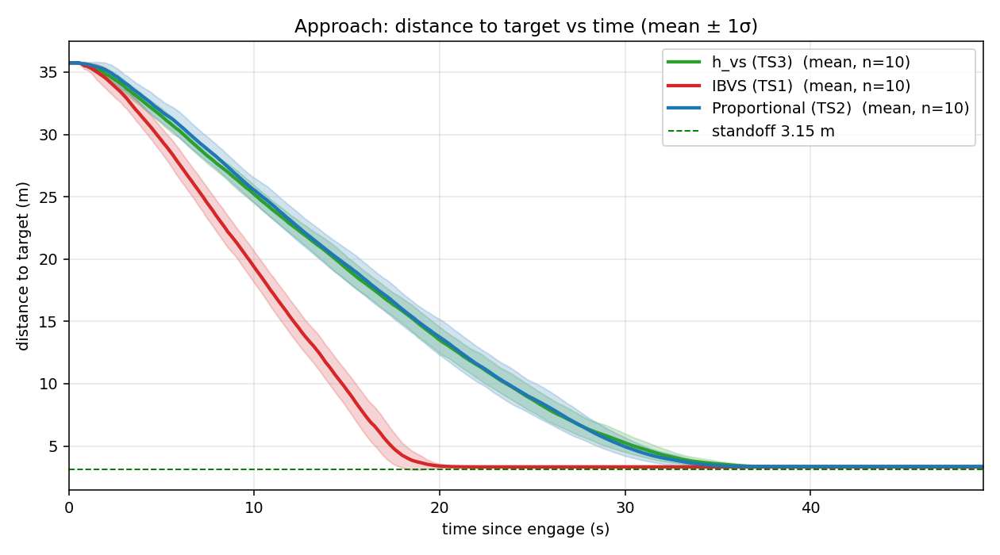
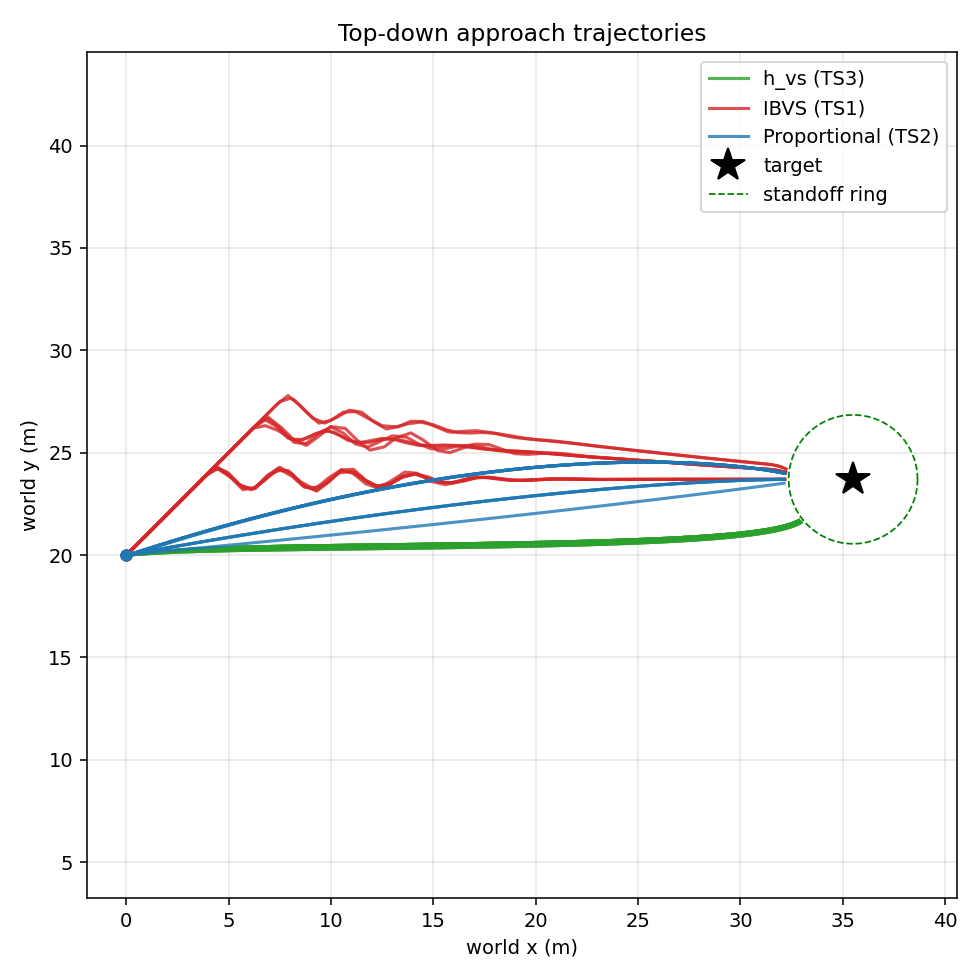
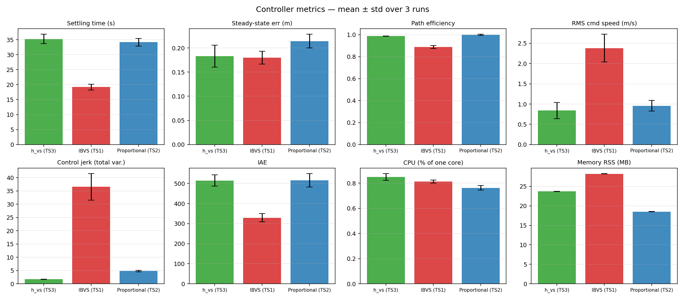

# HIL Controller Benchmark — IBVS vs Proportional vs h_vs (N=10 each)

**Date:** 2026-06-23 (all 30 runs)
**Branch:** `controller-benchmark`
**Plant:** MATLAB/Simulink HIL drone, CycloneDDS, oracle perception (perfect bbox)
**Subjects:** TS1 = IBVS (`visp_servo`, ViSP `vpServo`, 4 corners, L⁺) · TS2 = Proportional (`hil_servo`, P-law) · TS3 = h_vs (`h_vs_servo`, Benhimane & Malis homography-based VS)
**Shared:** identical FSM, safety filters, velocity limits (`max_linear=3.0 m/s`), camera geometry, oracle detector — the *only* difference between subjects is the servoing law.

Each controller flown **10 times** against an identical sim reset. All 30 runs healthy: full SEARCHING → APPROACHING → REACHED, zero overshoot, clean restart. Standoff target = **3.15 m** (`FY·KNOWN_H / (RATIO·IMG_H) = 554·1.5/(0.55·480)`).

> **CPU/memory are real.** `benchmarks/cpu_sampler.sh` resolves the live node by `/proc/<pid>/comm` and computes instantaneous %CPU from `/proc` jiffy deltas. CPU resolution is coarse (~1% steps at 1 Hz) but values are genuine and non-zero.

> **TS3 note — vx limitation:** The oracle always produces axis-aligned bboxes, so `getPerspectiveTransform` returns a pure affine homography (H[2,2]=1 → e_v[2]=0). The homography law cannot produce forward velocity from axis-aligned inputs, so vx reuses the TS2 proportional law (`k_fwd=3.0`); vy/vz/wz come from the homography, smoothed by a 5-tick moving average.

> **TS3 note — lateral parking:** For axis-aligned bboxes the homography's horizontal error feeds **both** lateral translation (`e_v[0]`) and yaw (`e_w[1]`) off the *identical* pixel-offset signal `(cx−cx0)/fx`. Yaw zeroes the image error from an offset position, which also switches off the lateral term — so h_vs tends to square up on the sign in the *camera* while parking slightly to the *side* in the world. This is an input-degeneracy artifact (oracle gives no perspective component to disambiguate position from heading), not a coding error.

---

## Headline result (mean ± std, N=10)

| Metric | IBVS (TS1) | Proportional (TS2) | h_vs (TS3) | Winner |
|---|---:|---:|---:|:--|
| **Settling time** (s) | **19.17 ± 0.97** | 34.14 ± 1.31 | 35.22 ± 1.58 | IBVS — fastest |
| **Steady-state error** (m) | **0.180 ± 0.014** | 0.214 ± 0.014 | 0.183 ± 0.023 | IBVS ≈ h_vs (tie) |
| **Overshoot** (m) | 0.00 | 0.00 | 0.00 | tie |
| **Path efficiency** | 0.887 ± 0.013 | **0.998 ± 0.005** | 0.986 ± 0.002 | Proportional |
| **RMS command speed** (m/s) | 2.38 ± 0.34 | 0.96 ± 0.13 | **0.84 ± 0.20** | h_vs — gentlest |
| **Control jerk** (total variation) | 36.53 ± 5.03 | 4.83 ± 0.27 | **1.69 ± 0.07** | h_vs — **smoothest** |
| **IAE** (∫\|err\|dt) | **329.0 ± 20.5** | 515.7 ± 33.8 | 514.6 ± 27.9 | IBVS — lowest error-time |
| **CPU** (% of one core) | 0.812 ± 0.012 | **0.762 ± 0.019** | 0.849 ± 0.026 | ≈ all negligible |
| **Memory RSS** (MB) | 28.24 ± 0.07 | **18.52 ± 0.03** | 23.72 ± 0.04 | Proportional — lightest |

**Three-way takeaway:** IBVS is fastest to settle (19 s) and lowest in accumulated error (IAE), but most aggressive — its jerk (36.5) is **22× h_vs and 7.5× Proportional**. h_vs is the slowest (35 s) but produces the **smoothest commands of all three** (jerk 1.69) *and* the **gentlest RMS command speed** (0.84 m/s) — the 5-tick moving average suppresses the chatter the other laws exhibit. Proportional is the efficient, lightweight middle ground: straightest path (0.998) and smallest footprint (18.5 MB). **Steady-state accuracy is a statistical tie between IBVS (0.180 m) and h_vs (0.183 m)** — their spreads overlap heavily; Proportional sits a touch higher (0.214 m). **CPU does not differentiate any of them** — the oracle replaces YOLO so none stresses a Pi 5 core.

> **Shift vs the earlier N=3 report:** at N=10 the steady-state-error edge moves from h_vs to IBVS (now within noise of each other), and the *gentlest RMS speed* moves from Proportional to h_vs. Jerk, settling, IAE, path-efficiency and footprint rankings are unchanged.

---

## Approach: distance to target vs time

Each curve is the **mean across 10 runs** with a **±1σ shaded band**. IBVS (red) reaches the 3.15 m standoff by ~19 s; Proportional (blue) and h_vs (green) nearly overlap, settling by ~34–35 s. IBVS shows a visibly wider band (more run-to-run variation in approach speed); Proportional and h_vs bands are tight. All curves converge onto the standoff line and **hold without overshoot**.

## Top-down trajectories

IBVS (red) **wiggles laterally** from regulating four image-point features directly. Proportional (blue) sweeps the straightest arcs. h_vs (green) approaches smoothly but **parks slightly off to the side** of the sign (see the lateral-parking note above).

## Metric comparison (mean ± std)

IBVS wins settling time and IAE. Proportional wins path efficiency, CPU and memory. h_vs wins **control jerk** (smoothest by ~3× over Proportional) and **RMS command speed**.

---

## Aggregate statistics — Mean ± Std (N=10 each, sample std, ddof=1)

| Metric | TS1 IBVS | TS2 Proportional | TS3 h_vs |
|---|---:|---:|---:|
| Settling time (s) | **19.17 ± 0.97** | 34.14 ± 1.31 | 35.22 ± 1.58 |
| Steady-state error (m) | **0.180 ± 0.014** | 0.214 ± 0.014 | 0.183 ± 0.023 |
| Overshoot (m) | 0.00 | 0.00 | 0.00 |
| Path efficiency | 0.887 ± 0.013 | **0.998 ± 0.005** | 0.986 ± 0.002 |
| RMS command speed (m/s) | 2.380 ± 0.343 | 0.957 ± 0.131 | **0.840 ± 0.200** |
| Control jerk (total variation) | 36.53 ± 5.03 | 4.831 ± 0.274 | **1.692 ± 0.066** |
| IAE (∫\|err\|dt) | **329.0 ± 20.5** | 515.7 ± 33.8 | 514.6 ± 27.9 |
| CPU (% of one core) | 0.812 ± 0.012 | **0.762 ± 0.019** | 0.849 ± 0.026 |
| Memory RSS (MB) | 28.24 ± 0.07 | **18.52 ± 0.03** | 23.72 ± 0.04 |

## Aggregate statistics — Median (N=10 each)

| Metric | TS1 IBVS | TS2 Proportional | TS3 h_vs |
|---|---:|---:|---:|
| Settling time (s) | **19.30** | 33.92 | 35.47 |
| Steady-state error (m) | **0.1795** | 0.2160 | 0.1808 |
| Overshoot (m) | 0.00 | 0.00 | 0.00 |
| Path efficiency | 0.8897 | **0.9947** | 0.9871 |
| RMS command speed (m/s) | 2.438 | 0.9986 | **0.8356** |
| Control jerk (total variation) | 37.81 | 4.878 | **1.732** |
| IAE (∫\|err\|dt) | **321.7** | 517.4 | 516.8 |
| CPU (% of one core) | 0.8114 | **0.7614** | 0.8366 |
| Memory RSS (MB) | 28.25 | **18.52** | 23.72 |

## Per-run data

| Run | Settle (s) | SS err (m) | Path eff | RMS spd | Jerk | IAE | CPU % | Mem MB |
|---|---:|---:|---:|---:|---:|---:|---:|---:|
| ibvs N1 | 18.51 | 0.165 | 0.864 | 2.22 | 40.68 | 318.4 | 0.833 | 28.27 |
| ibvs N2 | 20.12 | 0.201 | 0.900 | 2.21 | 38.66 | 350.9 | 0.813 | 28.31 |
| ibvs N3 | 19.61 | 0.168 | 0.906 | 2.51 | 28.79 | 339.7 | 0.800 | 28.16 |
| ibvs N4 | 17.85 | 0.172 | 0.873 | 2.15 | 35.26 | 298.3 | 0.810 | 28.24 |
| ibvs N5 | 19.20 | 0.173 | 0.882 | 2.48 | 36.95 | 322.6 | 0.796 | 28.27 |
| ibvs N6 | 18.51 | 0.160 | 0.878 | 2.39 | 33.62 | 314.0 | 0.824 | 28.24 |
| ibvs N7 | 18.09 | 0.192 | 0.893 | 2.78 | 40.78 | 318.7 | 0.818 | 28.14 |
| ibvs N8 | 19.40 | 0.191 | 0.894 | 2.64 | 40.28 | 320.8 | 0.818 | 28.19 |
| ibvs N9 | 19.40 | 0.186 | 0.887 | 1.64 | 42.23 | 337.8 | 0.804 | 28.37 |
| ibvs N10 | 21.06 | 0.187 | 0.898 | 2.78 | 28.07 | 369.0 | 0.800 | 28.26 |
| prop N1 | 34.20 | 0.218 | 0.994 | 0.78 | 5.20 | 544.4 | 0.788 | 18.50 |
| prop N2 | 35.94 | 0.226 | 1.005 | 1.12 | 4.41 | 538.3 | 0.765 | 18.48 |
| prop N3 | 33.01 | 0.191 | 0.993 | 1.04 | 5.19 | 509.3 | 0.787 | 18.50 |
| prop N4 | 32.32 | 0.221 | 0.995 | 0.89 | 4.72 | 456.2 | 0.743 | 18.53 |
| prop N5 | 35.32 | 0.227 | 1.004 | 0.99 | 4.79 | 525.5 | 0.746 | 18.48 |
| prop N6 | 34.92 | 0.192 | 0.994 | 1.11 | 4.96 | 540.9 | 0.772 | 18.54 |
| prop N7 | 35.90 | 0.233 | 0.995 | 0.73 | 4.97 | 568.2 | 0.775 | 18.59 |
| prop N8 | 33.18 | 0.212 | 0.994 | 1.02 | 4.97 | 486.5 | 0.758 | 18.52 |
| prop N9 | 32.98 | 0.205 | 1.003 | 0.89 | 4.55 | 489.1 | 0.737 | 18.53 |
| prop N10 | 33.65 | 0.214 | 1.004 | 1.00 | 4.55 | 498.5 | 0.746 | 18.55 |
| h_vs N1 | 32.11 | 0.178 | 0.987 | 0.97 | 1.73 | 466.9 | 0.871 | 23.68 |
| h_vs N2 | 35.29 | 0.185 | 0.987 | 0.60 | 1.75 | 526.2 | 0.818 | 23.77 |
| h_vs N3 | 33.81 | 0.176 | 0.987 | 1.14 | 1.74 | 481.3 | 0.882 | 23.65 |
| h_vs N4 | 35.31 | 0.194 | 0.988 | 1.16 | 1.74 | 499.3 | 0.900 | 23.71 |
| h_vs N5 | 33.81 | 0.180 | 0.985 | 0.83 | 1.60 | 504.8 | 0.837 | 23.76 |
| h_vs N6 | 35.62 | 0.221 | 0.988 | 0.61 | 1.73 | 508.5 | 0.832 | 23.72 |
| h_vs N7 | 36.99 | 0.211 | 0.988 | 0.68 | 1.75 | 557.2 | 0.835 | 23.73 |
| h_vs N8 | 37.32 | 0.142 | 0.983 | 0.70 | 1.60 | 542.3 | 0.836 | 23.78 |
| h_vs N9 | 36.25 | 0.182 | 0.986 | 0.84 | 1.67 | 534.8 | 0.851 | 23.75 |
| h_vs N10 | 35.68 | 0.162 | 0.984 | 0.87 | 1.60 | 525.0 | 0.831 | 23.69 |

Full machine-readable table: [summary.csv](summary.csv).

## Bag folders used for evaluation (all 2026-06-23)

| Controller | Folders |
|---|---|
| TS1 ibvs | `bags/ctrl_ibvs_N{1..10}_20260623_19{0358,0605,0809,1104,1522,1839,2236,2513,2840,3159}` |
| TS2 proportional | `bags/ctrl_proportional_N{1..10}_20260623_{193408,194341,194551,194749,195020,195221,195502,200009,200159,200349}` |
| TS3 h_vs | `bags/ctrl_h_vs_N{1..10}_20260623_{200609,201801,202133,202411,202600,202843,203159,203717,204239,204628}` |

All 30 folders processed via `benchmarks/plot_controller_hil.py`; 3-way figures via `benchmarks/compare_controllers.py`.

---

## Interpretation

- **Prefer IBVS** when reaching the target fastest matters and the airframe tolerates aggressive, oscillatory commands. Settles ~45% faster than h_vs/Proportional and accumulates the least error-time (IAE 329). Cost: jerk 36.5 (22× h_vs) and the heaviest footprint (28 MB) — trivial on a Pi 5.
- **Prefer Proportional** when a straight, predictable path and a small footprint matter. Best path efficiency (0.998), lowest CPU (0.76%), lightest memory (18.5 MB). Smooth and efficient — the safe default for payload missions.
- **Prefer h_vs** when command smoothness is paramount — jerk is ~3× lower than Proportional and ~22× lower than IBVS, and it has the gentlest RMS command speed (0.84 m/s). Steady-state accuracy ties IBVS for best. Trade-offs: slowest to settle (~35 s), highest CPU (0.85%, still <1% of a core), and it **parks slightly to the side** of the sign rather than squarely in front (homography input degeneracy, see note).
- **CPU does not differentiate any of them.** All three sit under 0.9% of one core with the oracle replacing YOLO; this run isolates the *control law* by design.
- **All three are correct controllers:** zero overshoot, sub-0.22 m steady-state error against a 3.15 m standoff (< 7%), tight N=10 repeatability.

---

## Data quality

- **N=10 per controller** — spreads are now meaningful; reported std is sample std (ddof=1).
- **CPU/memory** — `benchmarks/cpu_sampler.sh` resolves the node via `/proc/<pid>/comm` (excludes the `ros2`/shell wrappers), skips zombies/zero-RSS, and computes instantaneous %CPU from jiffy deltas.
- Settling = first time `|dist − standoff| ≤ 0.30 m` held ≥ 2 s; t=0 = first SEARCHING→APPROACHING edge (search phase excluded by design).
- Path efficiency occasionally reads slightly >1.0 for Proportional (e.g. 1.005) — the near-straight measured path is marginally shorter than the start→end chord because the engage point is sampled a tick into motion; treat 0.998 as "essentially optimal."

---

*Analysed via `benchmarks/plot_controller_hil.py` + `benchmarks/compare_controllers.py` · figures in this directory · raw bags on the Pi under `bags/ctrl_{ibvs,proportional,h_vs}_N{1..10}_20260623_*`.*
