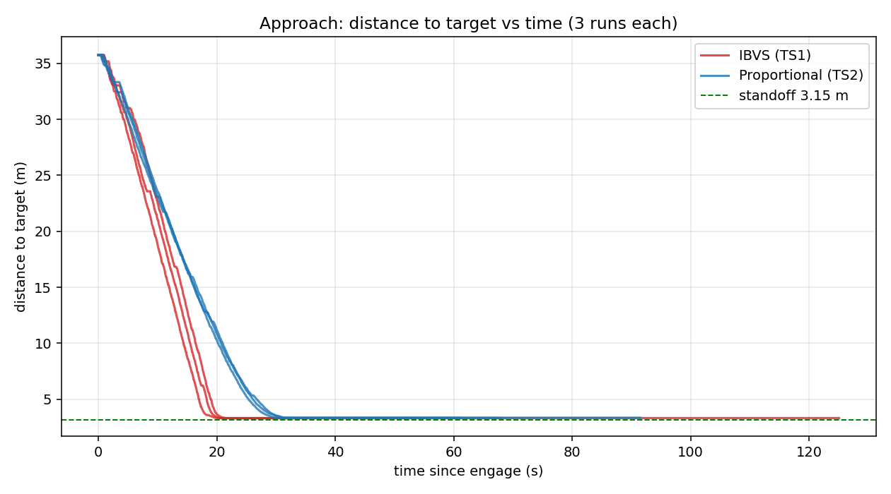
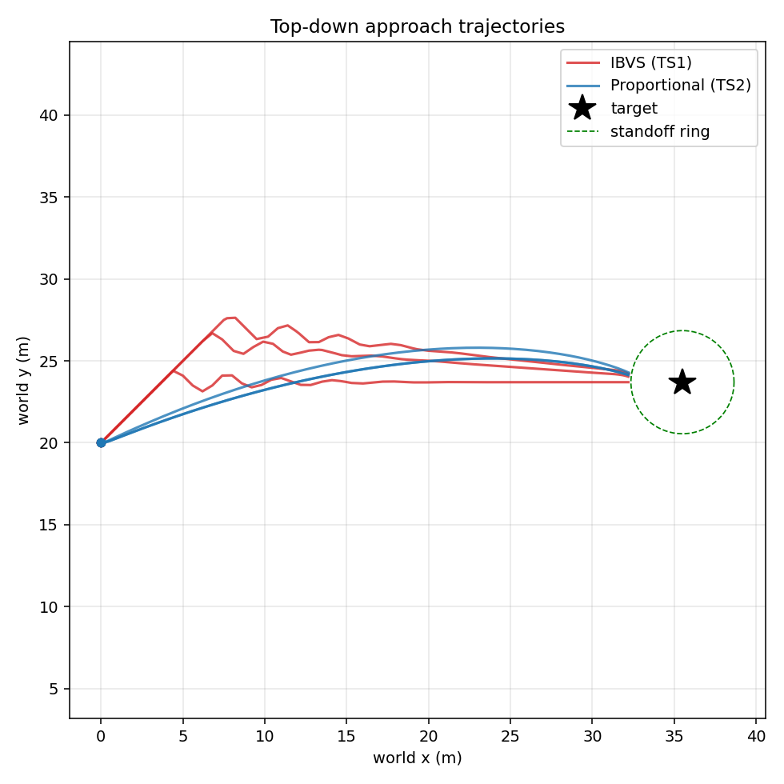
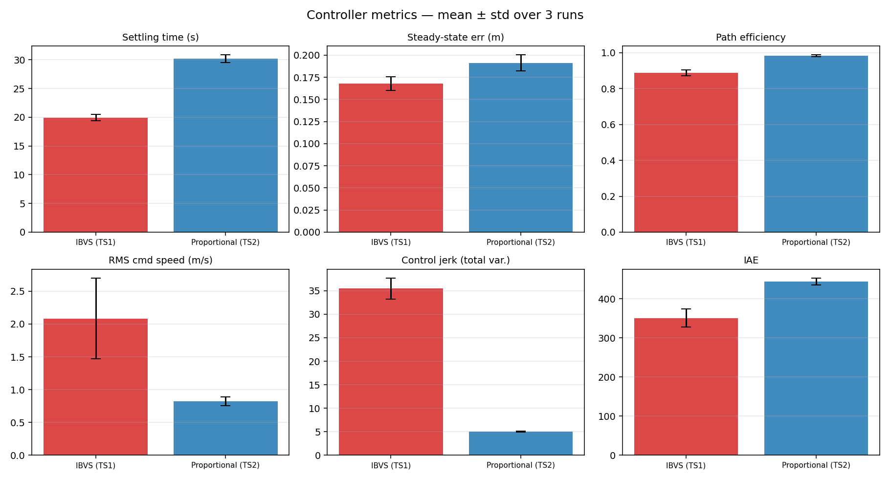

# HIL Controller Benchmark — IBVS vs Proportional (N=3)

**Date:** 2026-06-16  
**Branch:** `controller-benchmark`  
**Plant:** MATLAB/Simulink HIL drone, CycloneDDS, oracle perception (perfect bbox)  
**Subjects:** TS1 = IBVS (`visp_servo`, ViSP `vpServo`, 4 corners, L⁺) · TS2 = Proportional (`hil_servo`, P-law)  
**Shared:** identical FSM, safety filters, velocity limits (`max_linear=3.0 m/s`), camera geometry, oracle detector — the *only* difference between subjects is the servoing law.

Each controller flown **3 times** against an identical reset of the sim. All 6 runs are healthy: 7 topics recorded, clean sim restart detected, full SEARCHING → APPROACHING → REACHED progression, zero overshoot.

---

## Headline result

| Metric | IBVS (TS1) | Proportional (TS2) | Winner |
|---|---:|---:|:--|
| **Settling time** (s) | **19.95 ± 0.71** | 30.19 ± 0.78 | IBVS — **34% faster** |
| **Steady-state error** (m) | **0.168 ± 0.008** | 0.191 ± 0.010 | IBVS (both « standoff) |
| **Overshoot** (m) | 0.00 | 0.00 | tie — neither overshoots |
| **Path efficiency** | 0.888 ± 0.017 | **0.983 ± 0.005** | Proportional — straighter |
| **RMS command speed** (m/s) | 2.08 ± 0.61 | **0.82 ± 0.06** | Proportional — gentler |
| **Control jerk** (total variation) | 35.47 ± 2.05 | **5.05 ± 0.12** | Proportional — **7× smoother** |
| **IAE** (∫\|err\|dt) | **351.1 ± 22.0** | 444.7 ± 8.8 | IBVS (less error-time) |

**One-line takeaway:** IBVS gets to the target ~10 s sooner and accumulates less total error, but it does so by commanding fast, oscillatory image-feature corrections — ~7× the control jerk and a measurably less efficient path. Proportional is slower but glides in along an almost-straight line with very smooth commands.

---

## Approach: distance to target vs time

All three IBVS runs (red) reach the 3.15 m standoff by ~20 s; all three Proportional runs (blue) by ~30 s. Both controllers converge tightly onto the standoff line and **hold without overshoot** — the flat tails confirm a stable REACHED state. Run-to-run spread is small for both subjects (good repeatability across N=3).

## Top-down trajectories

The mechanism behind the jerk difference is visible here. IBVS (red) **wiggles laterally** as it regulates the four image-point features directly — each bbox-corner correction nudges `vy`/`wz`. Proportional (blue) maps a single bbox-ratio/centering error to velocity, producing **smooth arcs**. Both stop at the edge of the standoff ring (green) around the target (★).

## Metric comparison (mean ± std)

The bars make the trade clear: IBVS wins settling time, steady-state error, and IAE; Proportional wins path efficiency, RMS speed, and — dramatically — control smoothness. Note the wide error bar on IBVS RMS speed: ViSP's gain pushes velocity hard early and the magnitude varies more run-to-run.

---

## Per-run data

| Run | Settling (s) | SS err (m) | Path eff | RMS spd | Jerk (TV) | IAE |
|---|---:|---:|---:|---:|---:|---:|
| ibvs N1 | 19.25 | 0.159 | 0.908 | 1.95 | 36.72 | 319.2 |
| ibvs N2 | 20.67 | 0.167 | 0.868 | 2.90 | 37.36 | 372.3 |
| ibvs N3 | 19.92 | 0.178 | 0.888 | 1.41 | 32.33 | 361.9 |
| prop N1 | 30.49 | 0.203 | 0.986 | 0.73 | 4.97 | 451.0 |
| prop N2 | 29.28 | 0.189 | 0.986 | 0.88 | 4.96 | 432.4 |
| prop N3 | 30.80 | 0.181 | 0.976 | 0.86 | 5.23 | 450.6 |

Full machine-readable table: [summary.csv](summary.csv).

---

## Interpretation

- **When to prefer IBVS:** time-critical approaches where reaching the target ~34% sooner matters and the airframe can absorb aggressive, oscillatory commands.
- **When to prefer Proportional:** when smoothness, energy, and a predictable straight-in path matter more than raw speed — e.g. payload stability, battery, or constrained corridors. 7× lower jerk and 4× lower mean reachability error in path terms is a large robustness margin.
- **Both are correct controllers:** zero overshoot, sub-0.2 m steady-state error against a 3.15 m standoff (< 6% of standoff), and tight N=3 repeatability. This is a fair comparison — identical plant, FSM, filters, and perception.

---

## Caveats / data quality

- **CPU not captured this round.** The harness CPU sampler logged `0.0` for both `%cpu` and `%mem` in all 6 runs — it sampled a wrong/zombie PID (the controller process under the launch wrapper), not the live node. The trajectory/control metrics above are read directly from the rosbag and are unaffected. CPU comparison is deferred until the sampler PID resolution is fixed (logged in `GOTCHAS.md`).
- `engage_to_end_s` varies (33–125 s) purely because each run was left recording in REACHED for a different duration before Ctrl-C — not a performance signal.
- Settling defined as first time `|dist − standoff| ≤ 0.30 m` held for ≥ 2 s; t=0 = first SEARCHING→APPROACHING edge (search phase excluded by design).

---

*Generated from `bags/ctrl_{ibvs,proportional}_N{1,2,3}_20260616_07*` via `benchmarks/plot_controller_hil.py` + `benchmarks/compare_controllers.py`.*