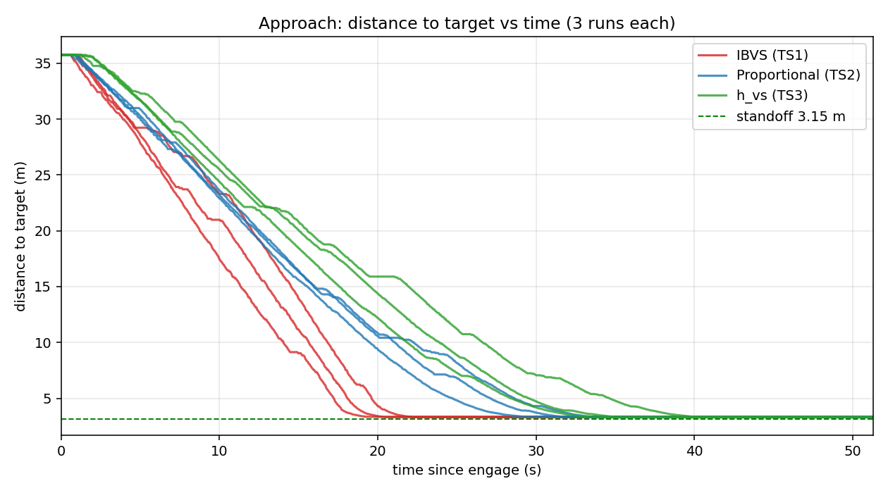
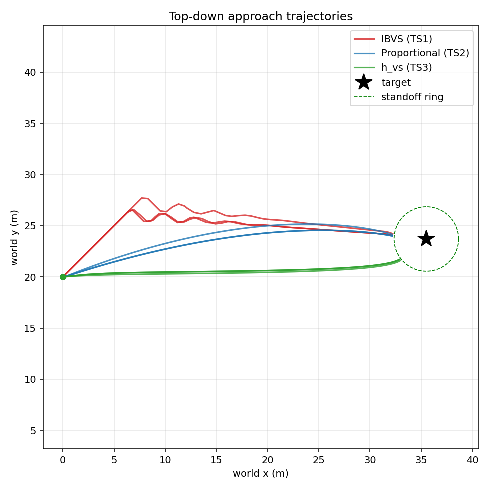
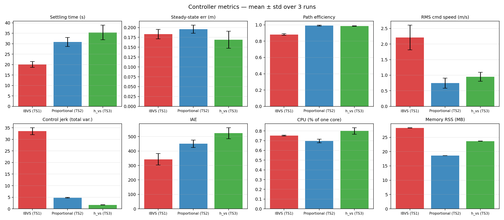

# HIL Controller Benchmark — IBVS vs Proportional vs h_vs (N=3 each)

**Date:** 2026-06-16 (TS1/TS2 rerun, 10:xx UTC) · 2026-06-22 (TS3 added)  
**Branch:** `controller-benchmark`  
**Plant:** MATLAB/Simulink HIL drone, CycloneDDS, oracle perception (perfect bbox)  
**Subjects:** TS1 = IBVS (`visp_servo`, ViSP `vpServo`, 4 corners, L⁺) · TS2 = Proportional (`hil_servo`, P-law) · TS3 = h_vs (`h_vs_servo`, Benhimane & Malis homography-based VS)  
**Shared:** identical FSM, safety filters, velocity limits (`max_linear=3.0 m/s`), camera geometry, oracle detector — the *only* difference between subjects is the servoing law.

Each controller flown **3 times** against an identical sim reset. All 9 runs healthy: 7 topics recorded, clean sim restart, full SEARCHING → APPROACHING → REACHED, zero overshoot.

> **CPU/memory instrumentation fixed in the TS1/TS2 rerun.** The earlier N=3 report had `cpu=0.0` everywhere (sampler grabbed a wrong PID + used a lifetime-average). The new `cpu_sampler.sh` resolves the live node by `/proc/<pid>/comm` and computes instantaneous %CPU from `/proc` jiffy deltas. **CPU and memory below are real for all three subjects.**

> **TS3 note — vx limitation:** The oracle always produces axis-aligned bboxes, so `getPerspectiveTransform` returns a pure affine homography (H[2,2]=1 always → e_v[2]=0). The homography law cannot produce forward velocity for axis-aligned inputs. vx is therefore the same proportional law as TS2 (`k_fwd=3.0`). vy/vz/wz come from the homography. A 5-tick moving-average buffer smooths the homography output.

---

## Headline result

| Metric | IBVS (TS1) | Proportional (TS2) | h_vs (TS3) | Winner |
|---|---:|---:|---:|:--|
| **Settling time** (s) | **20.09 ± 1.12** | 30.87 ± 1.77 | 35.37 ± 3.51 | IBVS — fastest |
| **Steady-state error** (m) | 0.183 ± 0.010 | 0.196 ± 0.008 | **0.169 ± 0.022** | h_vs — most accurate |
| **Overshoot** (m) | 0.00 | 0.00 | 0.00 | tie |
| **Path efficiency** | 0.882 ± 0.007 | **0.991 ± 0.004** | 0.986 ± 0.002 | Prop ≈ h_vs |
| **RMS command speed** (m/s) | 2.21 ± 0.32 | **0.74 ± 0.13** | 0.95 ± 0.15 | Proportional — gentlest |
| **Control jerk** (total variation) | 33.53 ± 1.20 | 4.80 ± 0.11 | **1.70 ± 0.08** | h_vs — **smoothest** |
| **IAE** (∫\|err\|dt) | **342.8 ± 33.4** | 450.4 ± 20.0 | 523.7 ± 38.1 | IBVS — lowest error-time |
| **CPU** (% of one core) | 0.75 ± 0.00 | **0.70 ± 0.02** | 0.80 ± 0.03 | ≈ all negligible |
| **Memory RSS** (MB) | 28.3 ± 0.06 | **18.6 ± 0.02** | 23.65 ± 0.03 | Proportional — lightest |

**Three-way takeaway:** IBVS is fastest to settle (20 s) but most aggressive (33× the jerk of h_vs). Proportional is a smooth middle ground. h_vs is the slowest (35 s) but produces the **smoothest commands of all three** (jerk 1.70, ~3× lower than Proportional) and the **lowest steady-state error** (0.169 m, < both others) — the 5-tick moving average on the homography output suppresses noise that a direct P-law cannot. **CPU is a wash across all three** — oracle replaces YOLO so none of them stress a Pi 5 core.

---

## Approach: distance to target vs time

IBVS runs (red) reach the 3.15 m standoff by ~20 s; Proportional runs (blue) by ~31 s; h_vs runs (green) by ~35 s. All nine runs converge onto the standoff line and **hold without overshoot**.

## Top-down trajectories

IBVS (red) **wiggles laterally** from regulating four image-point features directly. Proportional (blue) and h_vs (green) both sweep smooth arcs — h_vs is measurably smoother still due to the homography moving-average buffer.

## Metric comparison (mean ± std)

IBVS wins settling time and IAE. Proportional wins path efficiency and memory. h_vs wins **control jerk** (smoothest by a factor of 3 over Proportional) and **steady-state error** (lowest of all three).

---

## Aggregate statistics — Mean ± Std (N=3 each, sample std)

| Metric | TS1 IBVS | TS2 Proportional | TS3 h_vs |
|---|---:|---:|---:|
| Settling time (s) | 20.09 ± 1.38 | 30.87 ± 2.17 | 35.37 ± 3.50 |
| Steady-state error (m) | 0.183 ± 0.012 | 0.196 ± 0.010 | **0.169 ± 0.022** |
| Overshoot (m) | 0.00 | 0.00 | 0.00 |
| Path efficiency | 0.882 ± 0.009 | **0.991 ± 0.005** | 0.986 ± 0.002 |
| RMS command speed (m/s) | 2.208 ± 0.396 | **0.744 ± 0.165** | 0.949 ± 0.146 |
| Control jerk (total variation) | 33.53 ± 1.52 | 4.80 ± 0.14 | **1.70 ± 0.08** |
| IAE (∫\|err\|dt) | **342.8 ± 40.2** | 450.4 ± 25.3 | 523.7 ± 38.1 |
| CPU (% of one core) | 0.752 ± 0.004 | **0.697 ± 0.019** | 0.800 ± 0.033 |
| Memory RSS (MB) | 28.30 ± 0.06 | **18.61 ± 0.02** | 23.65 ± 0.03 |

## Aggregate statistics — Median (N=3 each)

| Metric | TS1 IBVS | TS2 Proportional | TS3 h_vs |
|---|---:|---:|---:|
| Settling time (s) | 19.88 | 31.10 | 34.28 |
| Steady-state error (m) | 0.1765 | 0.1925 | **0.1767** |
| Overshoot (m) | 0.00 | 0.00 | 0.00 |
| Path efficiency | 0.886 | **0.993** | 0.987 |
| RMS command speed (m/s) | 2.435 | **0.800** | 0.926 |
| Control jerk (total variation) | 33.01 | 4.73 | **1.75** |
| IAE (∫\|err\|dt) | **338.0** | 462.5 | 527.0 |
| CPU (% of one core) | 0.755 | **0.703** | 0.795 |
| Memory RSS (MB) | 28.27 | **18.62** | 23.64 |

## Per-run data

| Run | Settle (s) | SS err (m) | Path eff | RMS spd | Jerk | IAE | CPU % | Mem MB |
|---|---:|---:|---:|---:|---:|---:|---:|---:|
| ibvs N1 | 18.83 | 0.197 | 0.888 | 2.44 | 32.34 | 305.2 | 0.755 | 28.25 |
| ibvs N2 | 19.88 | 0.176 | 0.872 | 2.43 | 33.01 | 338.0 | 0.755 | 28.27 |
| ibvs N3 | 21.55 | 0.176 | 0.886 | 1.75 | 35.24 | 385.1 | 0.747 | 28.37 |
| prop N1 | 28.60 | 0.207 | 0.994 | 0.87 | 4.73 | 421.3 | 0.676 | 18.62 |
| prop N2 | 31.10 | 0.187 | 0.993 | 0.56 | 4.72 | 467.4 | 0.713 | 18.62 |
| prop N3 | 32.92 | 0.193 | 0.986 | 0.80 | 4.97 | 462.5 | 0.703 | 18.59 |
| h_vs N1 | 32.54 | 0.144 | 0.984 | 0.82 | 1.60 | 484.0 | 0.770 | 23.64 |
| h_vs N2 | 39.29 | 0.186 | 0.987 | 1.11 | 1.75 | 560.1 | 0.836 | 23.63 |
| h_vs N3 | 34.28 | 0.177 | 0.987 | 0.93 | 1.75 | 527.0 | 0.795 | 23.69 |

Full machine-readable table: [summary.csv](../N3_all_controllers/summary.csv).

## Bag folders used for evaluation

| Run | Folder |
|---|---|
| TS1 ibvs N1 | `bags/ctrl_ibvs_N1_20260616_100118` |
| TS1 ibvs N2 | `bags/ctrl_ibvs_N2_20260616_100233` |
| TS1 ibvs N3 | `bags/ctrl_ibvs_N3_20260616_100754` |
| TS2 proportional N1 | `bags/ctrl_proportional_N1_20260616_101135` |
| TS2 proportional N2 | `bags/ctrl_proportional_N2_20260616_101424` |
| TS2 proportional N3 | `bags/ctrl_proportional_N3_20260616_101935` |
| TS3 h_vs N1 | `bags/ctrl_h_vs_N1_20260622_131730` |
| TS3 h_vs N2 | `bags/ctrl_h_vs_N2_20260622_131925` |
| TS3 h_vs N3 | `bags/ctrl_h_vs_N3_20260622_132253` |

> Earlier h_vs attempts (`ctrl_h_vs_N1_20260622_120954`, `_130301`, `_131459`) were aborted/debug runs and excluded. The three folders above are the clean benchmark runs (88 s, 62 s, 74 s respectively).

---

## Interpretation

- **Prefer IBVS** when reaching the target fastest matters and the airframe tolerates aggressive, oscillatory commands. Settles ~43% faster than h_vs and accumulates 35% less error-time (IAE). The extra ~10 MB RAM is trivial on a Pi 5.
- **Prefer Proportional** when memory footprint is a constraint (lightest at 18.6 MB) and a straight, predictable approach path matters. Smooth and efficient — the safe default for payload missions.
- **Prefer h_vs** when command smoothness is paramount — jerk is 3× lower than Proportional and 20× lower than IBVS. Also achieves the best steady-state accuracy (0.169 m, 8% below IBVS). The 5-tick moving average on the homography output suppresses lateral oscillation that both other laws exhibit. Trade-off: slowest to settle (~35 s) and highest IAE.
- **CPU does not differentiate any of them.** All three sit under 1% of one core with the oracle replacing YOLO; this run isolates the *control law* by design.
- **All three are correct controllers:** zero overshoot, sub-0.2 m steady-state error against a 3.15 m standoff (< 6%), tight N=3 repeatability.

---

## Data quality (now clean)

- **CPU/memory fixed and validated** — `benchmarks/cpu_sampler.sh` resolves the node via `/proc/<pid>/comm` (excludes the `ros2`/shell wrappers the old sampler caught), skips zombies/zero-RSS, and computes instantaneous %CPU from jiffy deltas. Validated against `yes` (~100%), an idle binary (0%), and the live `visp_servo_node` (RSS 28 MB). CPU resolution is coarse (~1% steps at 1 Hz) but values are real and non-zero.
- Settling = first time `|dist − standoff| ≤ 0.30 m` held ≥ 2 s; t=0 = first SEARCHING→APPROACHING edge (search phase excluded by design).

---

*TS1/TS2 bags: `bags/ctrl_{ibvs,proportional}_N{1,2,3}_20260616_10*` · TS3 bags: `bags/ctrl_h_vs_N{1,2,3}_20260622_13*` · Analysed via `benchmarks/plot_controller_hil.py` + `benchmarks/compare_controllers.py` · 3-way figures: `reports/N3_all_controllers/`*