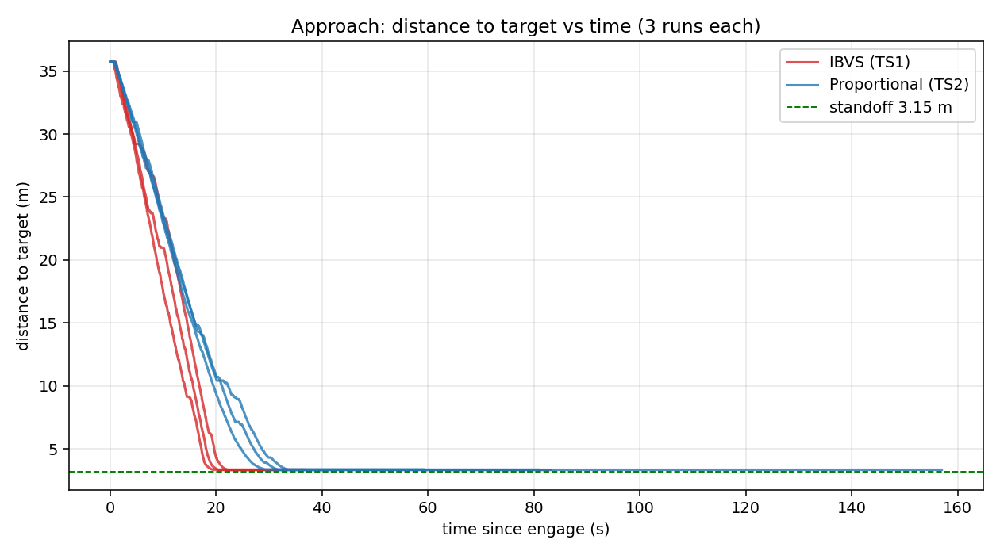
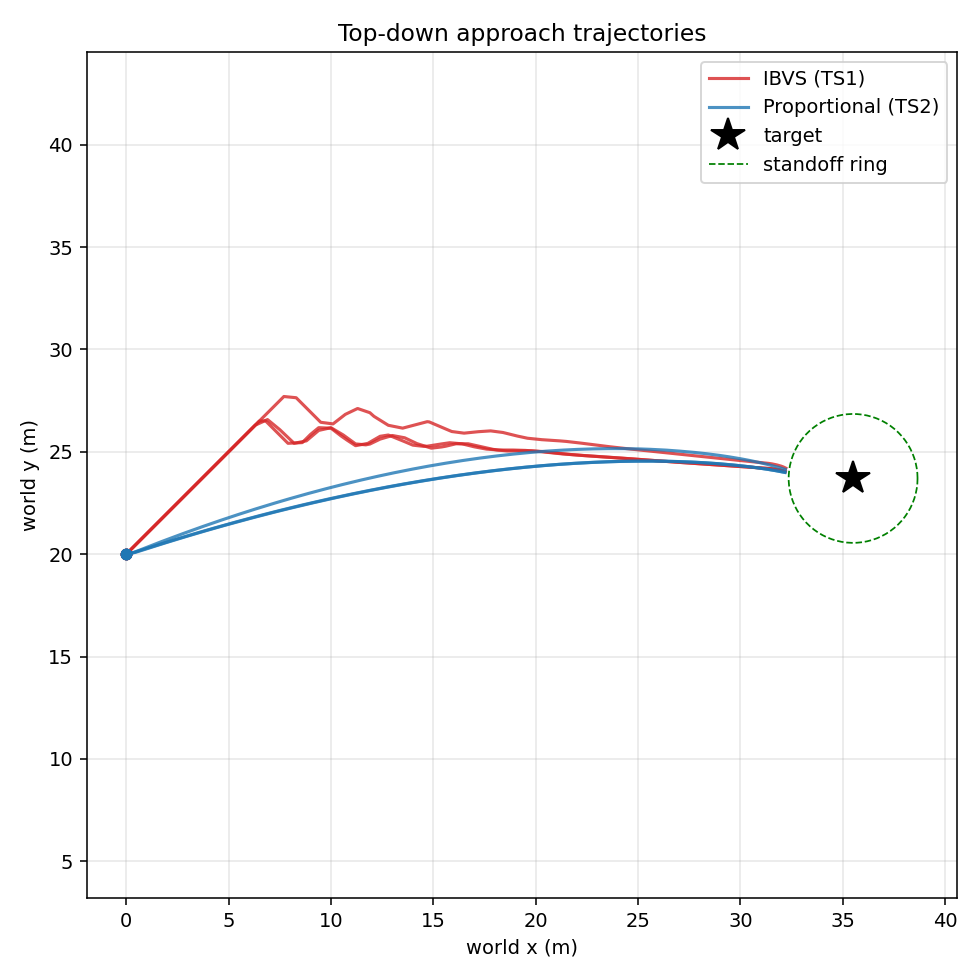
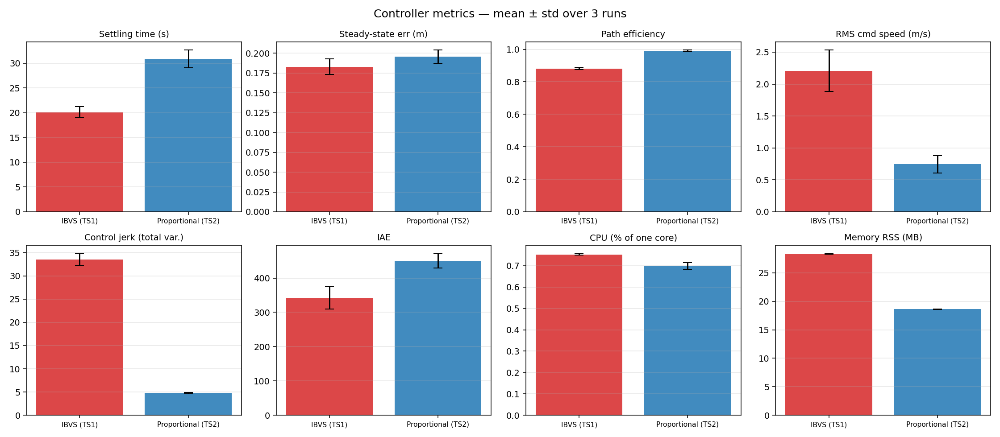

# HIL Controller Benchmark — IBVS vs Proportional (N=3, rerun)

**Date:** 2026-06-16 (rerun, 10:xx UTC set)  
**Branch:** `controller-benchmark`  
**Plant:** MATLAB/Simulink HIL drone, CycloneDDS, oracle perception (perfect bbox)  
**Subjects:** TS1 = IBVS (`visp_servo`, ViSP `vpServo`, 4 corners, L⁺) · TS2 = Proportional (`hil_servo`, P-law)  
**Shared:** identical FSM, safety filters, velocity limits (`max_linear=3.0 m/s`), camera geometry, oracle detector — the *only* difference between subjects is the servoing law.

Each controller flown **3 times** against an identical sim reset. All 6 runs healthy: 7 topics recorded, clean sim restart, full SEARCHING → APPROACHING → REACHED, zero overshoot.

> **This rerun fixes the CPU/memory instrumentation.** The earlier N=3 report had `cpu=0.0` everywhere (sampler grabbed a wrong PID + used a lifetime-average). The new `cpu_sampler.sh` resolves the live node by `/proc/<pid>/comm` and computes instantaneous %CPU from `/proc` jiffy deltas. **CPU and memory below are now real.** All other metrics reproduce the earlier run within noise.

---

## Headline result

| Metric | IBVS (TS1) | Proportional (TS2) | Winner |
|---|---:|---:|:--|
| **Settling time** (s) | **20.09 ± 1.12** | 30.87 ± 1.77 | IBVS — **35% faster** |
| **Steady-state error** (m) | **0.183 ± 0.010** | 0.196 ± 0.008 | IBVS (both « standoff) |
| **Overshoot** (m) | 0.00 | 0.00 | tie — neither overshoots |
| **Path efficiency** | 0.882 ± 0.007 | **0.991 ± 0.004** | Proportional — straighter |
| **RMS command speed** (m/s) | 2.21 ± 0.32 | **0.74 ± 0.13** | Proportional — gentler |
| **Control jerk** (total variation) | 33.53 ± 1.20 | **4.80 ± 0.11** | Proportional — **7× smoother** |
| **IAE** (∫\|err\|dt) | **342.8 ± 33.4** | 450.4 ± 20.0 | IBVS (less error-time) |
| **CPU** (% of one core) | 0.75 ± 0.00 | **0.70 ± 0.02** | ≈ tie — both negligible |
| **Memory RSS** (MB) | 28.3 ± 0.06 | **18.6 ± 0.02** | Proportional — **~52% lighter** |

**One-line takeaway:** IBVS reaches the target ~11 s sooner with less accumulated error, but pays for it in 7× the control jerk and ~52% more memory (the ViSP runtime). Proportional is slower but glides in along an almost-straight, very smooth path with a smaller footprint. **CPU is a wash** — with the oracle replacing YOLO, neither controller troubles a Pi 5 core (< 1%).

---

## Approach: distance to target vs time

All three IBVS runs (red) reach the 3.15 m standoff by ~20 s; all three Proportional runs (blue) by ~31 s. Both converge tightly onto the standoff line and **hold without overshoot**. Run-to-run spread is small for both — good repeatability across N=3.

## Top-down trajectories

IBVS (red) **wiggles laterally** as it regulates the four image-point features directly; Proportional (blue) maps a single bbox-ratio/centering error to velocity and sweeps **smooth arcs**. Both stop at the edge of the standoff ring around the target.

## Metric comparison (mean ± std)

IBVS wins settling time, steady-state error, and IAE. Proportional wins path efficiency, RMS speed, control smoothness, and memory. The two new panels: **CPU** is near-identical and tiny for both; **Memory** shows IBVS carrying ~10 MB more for the ViSP library.

---

## Per-run data

| Run | Settle (s) | SS err (m) | Path eff | RMS spd | Jerk | IAE | CPU % | Mem MB |
|---|---:|---:|---:|---:|---:|---:|---:|---:|
| ibvs N1 | 18.83 | 0.197 | 0.888 | 2.44 | 32.34 | 305.2 | 0.76 | 28.25 |
| ibvs N2 | 19.88 | 0.176 | 0.872 | 2.43 | 33.01 | 338.0 | 0.75 | 28.27 |
| ibvs N3 | 21.55 | 0.176 | 0.886 | 1.75 | 35.24 | 385.1 | 0.75 | 28.37 |
| prop N1 | 28.60 | 0.207 | 0.994 | 0.87 | 4.73 | 421.3 | 0.68 | 18.62 |
| prop N2 | 31.10 | 0.187 | 0.993 | 0.56 | 4.72 | 467.4 | 0.71 | 18.62 |
| prop N3 | 32.92 | 0.193 | 0.986 | 0.80 | 4.97 | 462.5 | 0.70 | 18.59 |

Full machine-readable table: [summary.csv](summary.csv).

---

## Interpretation

- **Prefer IBVS** when reaching the target ~35% sooner matters and the airframe tolerates aggressive, oscillatory commands; the extra ~10 MB RAM is trivial on a Pi 5.
- **Prefer Proportional** when smoothness, energy, a predictable straight-in path, and a smaller footprint matter more than raw speed — 7× lower jerk and a tighter, more efficient path.
- **CPU does not differentiate them here.** Both sit under 1% of one core because the oracle detector replaces the heavy YOLO perception stage. A real-perception benchmark would shift this picture; this run isolates the *control law*, by design.
- **Both are correct controllers:** zero overshoot, sub-0.2 m steady-state error against a 3.15 m standoff (< 6%), tight N=3 repeatability. Fair comparison — identical plant, FSM, filters, perception.

---

## Data quality (now clean)

- **CPU/memory fixed and validated** — `benchmarks/cpu_sampler.sh` resolves the node via `/proc/<pid>/comm` (excludes the `ros2`/shell wrappers the old sampler caught), skips zombies/zero-RSS, and computes instantaneous %CPU from jiffy deltas. Validated against `yes` (~100%), an idle binary (0%), and the live `visp_servo_node` (RSS 28 MB). CPU resolution is coarse (~1% steps at 1 Hz) but values are real and non-zero.
- Settling = first time `|dist − standoff| ≤ 0.30 m` held ≥ 2 s; t=0 = first SEARCHING→APPROACHING edge (search phase excluded by design).

---

*Generated from `bags/ctrl_{ibvs,proportional}_N{1,2,3}_20260616_10*` via `benchmarks/plot_controller_hil.py` + `benchmarks/compare_controllers.py`.*