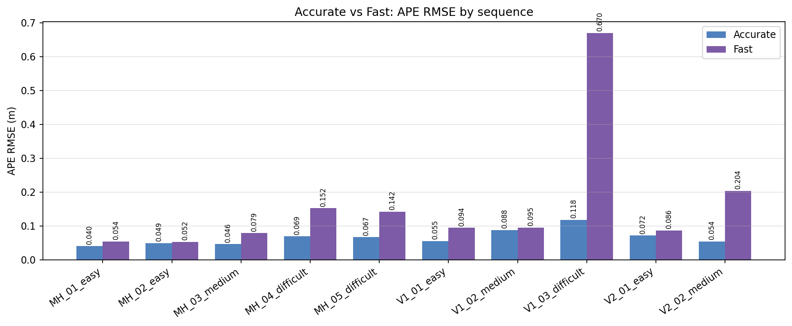
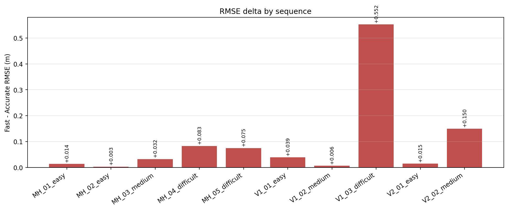
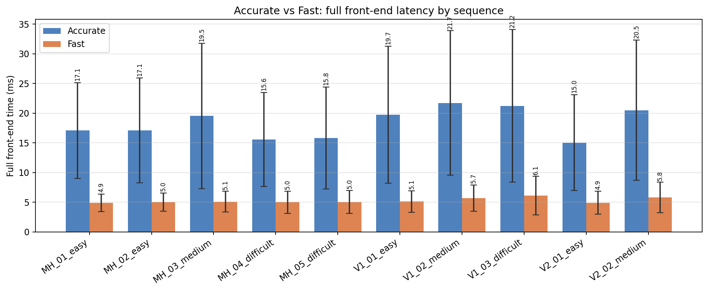
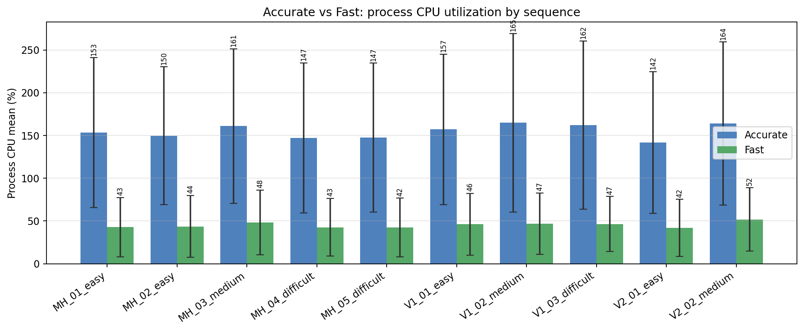
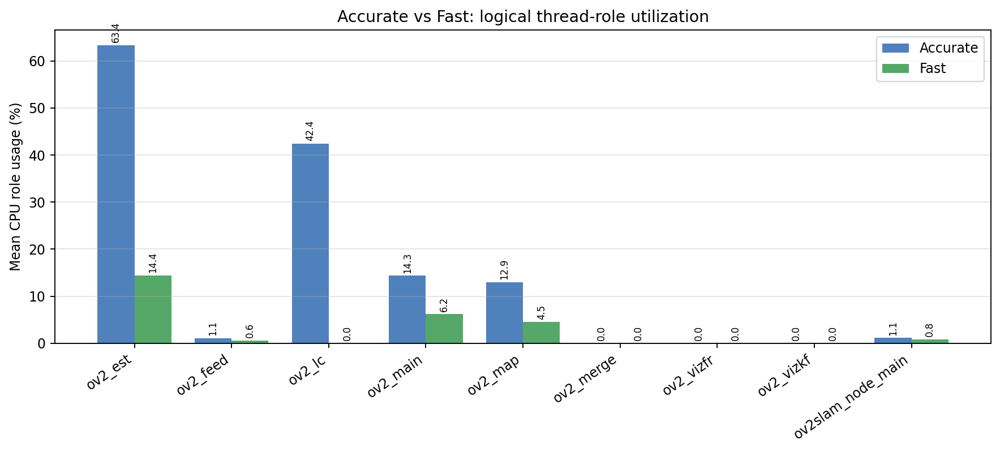

# OV2SLAM Accurate vs Fast Comparison Report

This report contrasts the `Latest_ACCURATE_Test` and `Latest_FAST_Test` result sets over the same 10 EuRoC sequences. The comparison is organized around **accuracy**, **latency**, and **core/thread utilization**, using the saved trajectories and logs rather than trusting the incomplete top-level summary files alone.

## Executive Comparison

- **Accuracy:** fast is better on **0/10** sequences and worse on **10/10** sequences, with an average RMSE delta of **+0.097 m** (`fast - accurate`).
- **Latency:** fast reduces full front-end time by **13.06 ms on average** (`-13.06 ms` delta), equivalent to an average **3.47x** front-end speedup.
- **Core utilization:** fast changes process CPU mean by **-109.5%** on average, and it materially reduces the dominant optimization-role footprint relative to accurate mode.

## Accuracy Comparison

| Sequence | Accurate RMSE (m) | Fast RMSE (m) | RMSE delta (fast-accurate) | Accurate matched | Fast matched |
| --- | ---: | ---: | ---: | ---: | ---: |
| MH_01_easy | 0.040172 | 0.054081 | +0.013909 | 410/419 (97.9%) | 405/417 (97.1%) |
| MH_02_easy | 0.049323 | 0.052482 | +0.003159 | 412/419 (98.3%) | 405/414 (97.8%) |
| MH_03_medium | 0.046219 | 0.078613 | +0.032394 | 508/511 (99.4%) | 489/493 (99.2%) |
| MH_04_difficult | 0.069219 | 0.152413 | +0.083194 | 344/347 (99.1%) | 334/337 (99.1%) |
| MH_05_difficult | 0.066874 | 0.141954 | +0.075080 | 364/368 (98.9%) | 343/347 (98.8%) |
| V1_01_easy | 0.055497 | 0.094320 | +0.038823 | 410/411 (99.8%) | 453/454 (99.8%) |
| V1_02_medium | 0.088209 | 0.094627 | +0.006418 | 557/558 (99.8%) | 556/559 (99.5%) |
| V1_03_difficult | 0.117647 | 0.669767 | +0.552120 | 774/779 (99.4%) | 775/777 (99.7%) |
| V2_01_easy | 0.071501 | 0.086232 | +0.014731 | 355/358 (99.2%) | 332/335 (99.1%) |
| V2_02_medium | 0.053746 | 0.203507 | +0.149761 | 778/780 (99.7%) | 737/740 (99.6%) |

Difference notes:
- Fast mode provides slightly worse APE on most sequences, with the clearest degradations appearing on the more difficult runs.
- The explicit RMSE delta makes it easy to state whether fast mode is an acceptable trade-off sequence-by-sequence.
- Meeting phrasing: “fast mode buys speed, but its accuracy penalty is sequence dependent and grows on harder trajectories.”

## Latency Comparison

| Sequence | Accurate FE mean±std (ms) | Fast FE mean±std (ms) | FE delta (ms) | FE speedup | Accurate Local BA (ms) | Fast Local BA (ms) |
| --- | --- | --- | ---: | ---: | ---: | ---: |
| MH_01_easy | 17.083 ± 8.072 | 4.895 ± 1.457 | -12.188 | 3.49x | 292.162 | 41.283 |
| MH_02_easy | 17.088 ± 8.843 | 5.025 ± 1.525 | -12.064 | 3.40x | 280.729 | 38.392 |
| MH_03_medium | 19.522 ± 12.261 | 5.088 ± 1.749 | -14.434 | 3.84x | 211.707 | 33.928 |
| MH_04_difficult | 15.578 ± 7.918 | 4.990 ± 1.874 | -10.589 | 3.12x | 195.941 | 28.558 |
| MH_05_difficult | 15.815 ± 8.577 | 5.036 ± 1.937 | -10.779 | 3.14x | 223.581 | 31.544 |
| V1_01_easy | 19.733 ± 11.533 | 5.114 ± 1.798 | -14.618 | 3.86x | 271.416 | 32.296 |
| V1_02_medium | 21.698 ± 12.176 | 5.698 ± 2.219 | -16.001 | 3.81x | 140.398 | 17.691 |
| V1_03_difficult | 21.225 ± 12.867 | 6.105 ± 3.241 | -15.120 | 3.48x | 86.274 | 7.846 |
| V2_01_easy | 15.033 ± 8.070 | 4.908 ± 1.915 | -10.125 | 3.06x | 212.102 | 28.772 |
| V2_02_medium | 20.488 ± 11.812 | 5.793 ± 2.575 | -14.695 | 3.54x | 107.253 | 16.232 |

Difference notes:
- Fast mode consistently cuts front-end latency, often by a large margin, and this is the clearest advantage of the fast configuration.
- Local BA cost also drops sharply in fast mode, which reinforces that the speedup is not only detector-side but also backend-facing.
- Meeting phrasing: “the main value of fast mode is predictable latency reduction, not a minor optimization around the edges.”

## Core and Thread Utilization Comparison

| Sequence | Accurate CPU mean±std (max) | Fast CPU mean±std (max) | CPU delta | Accurate top roles | Fast top roles |
| --- | --- | --- | ---: | --- | --- |
| MH_01_easy | 153.4% ± 87.5% (max 367.3%) | 42.8% ± 34.8% (max 169.7%) | -110.6% | ov2_est, ov2_lc, ov2_main | ov2_est, ov2_main, ov2_map |
| MH_02_easy | 149.6% ± 80.7% (max 370.8%) | 43.6% ± 36.2% (max 170.5%) | -106.0% | ov2_est, ov2_lc, ov2_main | ov2_est, ov2_main, ov2_map |
| MH_03_medium | 160.9% ± 90.4% (max 373.3%) | 48.4% ± 37.7% (max 170.4%) | -112.5% | ov2_est, ov2_lc, ov2_map | ov2_est, ov2_main, ov2_map |
| MH_04_difficult | 147.0% ± 87.8% (max 355.1%) | 42.7% ± 33.8% (max 162.7%) | -104.3% | ov2_est, ov2_lc, ov2_main | ov2_est, ov2_main, ov2_map |
| MH_05_difficult | 147.5% ± 87.1% (max 395.1%) | 42.3% ± 34.4% (max 169.7%) | -105.2% | ov2_est, ov2_lc, ov2_main | ov2_est, ov2_main, ov2_map |
| V1_01_easy | 157.1% ± 87.8% (max 377.4%) | 46.1% ± 36.2% (max 171.6%) | -111.0% | ov2_est, ov2_lc, ov2_map | ov2_est, ov2_main, ov2_map |
| V1_02_medium | 164.9% ± 104.3% (max 380.9%) | 46.8% ± 36.0% (max 153.8%) | -118.1% | ov2_est, ov2_lc, ov2_map | ov2_est, ov2_main, ov2_map |
| V1_03_difficult | 162.0% ± 98.4% (max 374.8%) | 46.6% ± 32.0% (max 168.7%) | -115.4% | ov2_lc, ov2_est, ov2_main | ov2_est, ov2_main, ov2_map |
| V2_01_easy | 141.7% ± 82.8% (max 359.5%) | 42.0% ± 33.3% (max 169.7%) | -99.7% | ov2_est, ov2_lc, ov2_main | ov2_est, ov2_main, ov2_map |
| V2_02_medium | 163.9% ± 95.4% (max 397.9%) | 51.9% ± 37.2% (max 154.2%) | -112.0% | ov2_est, ov2_lc, ov2_map | ov2_est, ov2_map, ov2_main |

| Logical role | Accurate mean (%) | Fast mean (%) | Delta (fast-accurate) |
| --- | ---: | ---: | ---: |
| `ov2_est` | 63.386 | 14.445 | -48.941 |
| `ov2_feed` | 1.084 | 0.626 | -0.459 |
| `ov2_lc` | 42.399 | 0.000 | -42.399 |
| `ov2_main` | 14.343 | 6.192 | -8.150 |
| `ov2_map` | 12.944 | 4.509 | -8.435 |
| `ov2_merge` | 0.000 | 0.000 | +0.000 |
| `ov2_vizfr` | 0.000 | 0.000 | +0.000 |
| `ov2_vizkf` | 0.000 | 0.000 | +0.000 |
| `ov2slam_node_main` | 1.118 | 0.801 | -0.318 |

Difference notes:
- Accurate mode drives much heavier sustained optimization load, especially through `ov2_est` and `ov2_lc`.
- Fast mode lowers overall process CPU and collapses the loop-closure contribution, which is consistent with the fast parameter set disabling that expensive path.
- Meeting phrasing: “fast mode does not just shorten latency; it also reduces total multi-core pressure by trimming optimization work.”

## Linked Source Reports

- [Accurate report](Latest_ACCURATE_Test/OV2SLAM_accurate_profile_report.md)
- [Fast report](Latest_FAST_Test/OV2SLAM_fast_profile_report.md)
